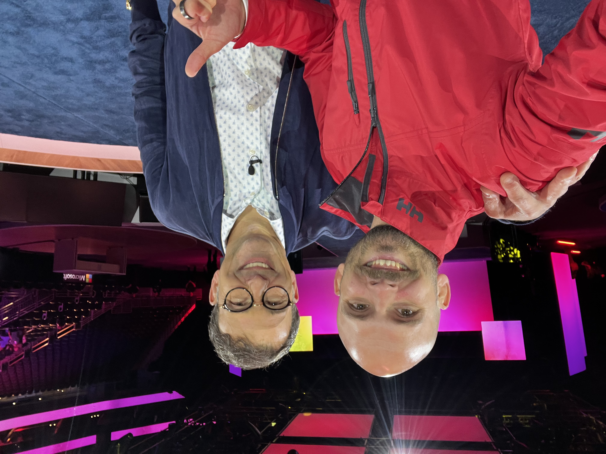

# Ben Martin Baur

**Technical Architect · Office of the CTO · Microsoft Innovation Hub Germany**

---

## 👀 About Me 

Hi, I'm Ben — a Technical Architect working in the Office of the CTO at the Microsoft Innovation Hub for Germany and Austria. With over 15 years of international experience in enterprise architecture, End-User Computing, and cloud technologies, I help customers to turn their vision into scalable architectures. Within the Innovation Hub, I operate at the intersection of technology strategy, AI transformation and customer impact.

Born on premise — living in the cloud. I started my career racking servers and managing on-prem infrastructure. Today I partner with Microsoft's most strategic enterprise customers, engineering teams and partners to shape end-to-end architectures. I think in systems — connecting technology, business, and people to deliver outcomes at scale.

 

## My Unfair Advantage

Most tech bloggers are either deep engineers or strategy consultants. I am both — and I am sitting in Microsoft's CTO office with direct customer access. 🤯🤯🤯. Every piece of content I create (should) reinforce: "I've been in the room, I've built the thing, and here's what actually works."

---

## 🗻 Impact at a Glance 

- **Led large scale End-User Computing projects from 75,000+ Cloud PCs & 100,000+ Virtual Machines** — Architected and won the largest Windows 365 and Azure Virtual Desktop environments worldwide
- **36 Advanced Cloud Experts** — Built and led a cross-EMEA technical team, reporting into directly to the COO of SME&C EMEA.
- **1,200+ Cloud Solution Architects** — Trained through technical bootcamps and readiness programs I designed and co-founded
- **Formed and led 15+ cross-EMEA initiatives** — From go-to-market accelerators to strategic sales plays for Windows 365, Azure Virtual Desktop and High-Performance Computing workloads.
- **Published author** — Contributed and authored several Azure Well-Architected Framework, Cloud Adoption Framework, and Architecture Center documentations

---

## 🗺️ Career Journey

### Architect & Strategist — Microsoft *(2021 – Present)*

**Technical Architect — Innovation Hub & Office of the CTO** *(2026 – Present)*

**Senior Windows Cloud Solution Engineer** *(2025 – 2026)*

**Senior Cloud Endpoint Technical Specialist** *(2024 – 2025)*

**Senior Manager — Azure Technical Specialists** *(2023 – 2024)*

**Manager — Cloud Solution Architects & Advanced Cloud Experts** *(2021 – 2023)*

In six years I grew from an individual contributor to leading a 36-person technical organisation across EMEA, and then moved into the Office of the CTO. Today I shape end-to-end architecture and AI transformation strategies for Microsoft's most strategic customers.

Along the way I reported into the COO of EMEA, co-founded Azure Bootcamps, the Windows Cloud Academy at scale, authored Azure framework documentation, and architected the largest Windows 365 and AVD deployments worldwide. 

In 2025, I was recognised with the **Microsoft Pinnacle Award** — This awarded is recognizing 43 individuals (0.007%) across the entire company — for outstanding leadership, community impact, and customer outcomes.

### 🥷 Deep Technical Specialist — Microsoft *(2020 – 2021)*

**Advanced Cloud Expert — Azure Virtual Desktop** · **Azure Cloud Solution Architect**

EMEA-wide deep-technical specialist for Azure Virtual Desktop, Windows 365, GPU-powered workloads, and HPC. Led Well-Architected design sessions, proofs of concept, and large-scale deployments. Engaged CXOs as an Executive Briefing Center speaker and served as the voice of the customer to Microsoft engineering.

### Before Microsoft *(2009 – 2019)*

**System Engineer — HUGO BOSS** · **Head of Internal IT — RaceChip** · **System Engineer — IT-Works GmbH**

A decade building the foundation: from nearly 8 years designing cloud infrastructure and End-User Computing solutions for multinational customers at IT-Works, to leading all IT operations and a global WAN strategy (Hong Kong–Germany–US) as Head of IT at RaceChip, to owning the Citrix and Windows 10 virtual desktop infrastructure at HUGO BOSS — including a global retail rollout and Active Directory redesign.

---

## 🏅 Recognition

**Microsoft Pinnacle Award FY25** — Awarded to only 43 individuals out of 228,000+ Microsoft employees (0.007%) annually. Recognises outstanding leadership and impact. Awarded for empowering internal and external communities to exceed their goals, and for architecting and winning the largest Windows 365 and Azure Virtual Desktop environments worldwide — 75,000+ Cloud PCs and 100,000+ Virtual Machines.

 

**Microsoft Gold Award** — Recognises sustained excellence and significant business impact across Microsoft.

---

## Speaking & Writing

- **Author** — Principal Author of the [Multi-Region BCDR guidance for Azure Virtual Desktop](https://learn.microsoft.com/en-us/azure/architecture/example-scenario/azure-virtual-desktop/azure-virtual-desktop-multi-region-bcdr) and other Azure Well-Architected Framework, Cloud Adoption Framework, and Architecture Center contributions
- **Co-founder** — [AVD Punks](https://www.avdpunks.com/) technical community blog
- **Writer** — [The Architect](/) blog on AI strategy, leadership, and hands-on technology

---

## 🏎️ What Drives Me

Most AI transformations fail not because the technology isn't ready — but because they jump directly on a solution without understanding and defining their problem and then design the architecture. They jump to models and demos without solving for data gravity, governance, or change management. I've made it my job to fix that gap.

My leadership philosophy is simple: 

````
"I lead by example, inspire with passion and I use every day to hit refresh to deliver a world-class customer experience and to bring strategies to life."
````

I care about making complex technology accessible and useful — not just technically possible. And I've found that the best way to grow is to empower others to exceed their own goals.

---

## About This Blog

**The Architect** is my space to think out loud. I write about the things I'm learning, the patterns I'm seeing, and the ideas I think are worth exploring — from AI project strategy and leadership in technical roles to hands-on experiments with tools like GitHub Copilot.

I built this blog from scratch using [Hugo](https://gohugo.io/), the [Stack theme](https://stack.jimmycai.com/), and GitHub Copilot — a hands-on experiment in how AI tools are changing who can build what.

---

## ✌️ Let's Connect

I'm always interested in conversations about enterprise-scale architecture, AI transformation leadership, or roles where technology strategy meets customer impact. Beyond tech, I love to expand my professional network — reach out if you want to geek out about cloud solutions, DJing, or surfing.

- [GitHub](https://github.com/benmartinbaur)
- [LinkedIn](https://www.linkedin.com/in/ben-martin-baur/)
- [AVD Punks Blog](https://www.avdpunks.com/)
