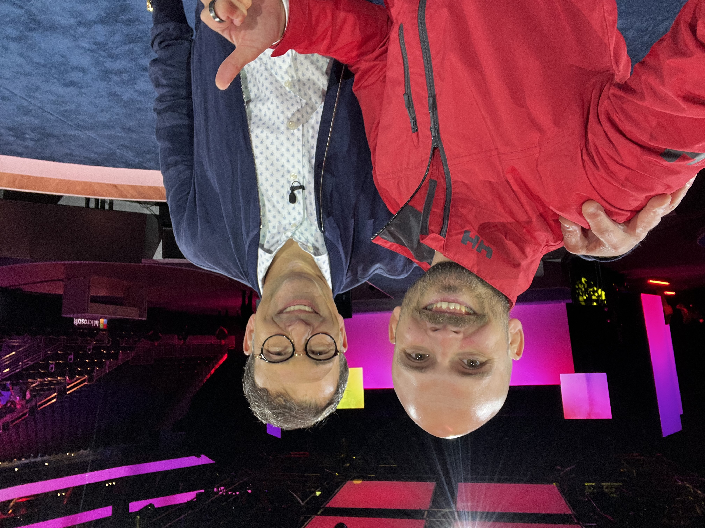

# Ben Martin Baur

**Technical Architect · Office of the CTO · Microsoft Innovation Hub Germany**

---

## Who I Am

Hi, I’m Ben — a Technical Architect in Microsoft’s Office of the CTO for Germany and Austria. For 15+ years, I’ve worked across enterprise architecture, End-User Computing, and cloud transformation to help customers turn ambition into operating systems that scale.

Born on premise — living in the cloud. I started by racking servers and running on-prem environments. Today I partner with enterprise leadership, engineering teams, and field organizations to shape AI and cloud architectures that hold up in production.

## My Advantage

Most technology voices are either deeply technical or purely strategic. I work in both rooms, every week, with direct customer exposure. That is the lens behind this site: what works in the boardroom, and what still works when you open the terminal.

---

## About This Blog

> *From the server room to the boardroom.*

**B3N.B4UR_** is where I document field-tested thinking. Every post sits in one of three lanes:

1. 🏗️ **Build** — Architecture patterns, technical walkthroughs, and automation.
2. 🗺️ **Strategy** — Frameworks, decision models, and enterprise transformation patterns.
3. 🎤 **Real** — Leadership lessons, personal reflections, and hard-earned career insights.

If you are a CTO, architect, principal-track engineer, or emerging leader, this site is designed to be practical first.

---

## Impact at a Glance

- **75,000+ Cloud PCs and 100,000+ VMs** architected across major Windows 365 and AVD programs.
- **36-person cross-EMEA technical organization** built and led across multiple markets.
- **1,200+ Cloud Solution Architects** trained through bootcamps and readiness programs.
- **15+ strategic cross-EMEA initiatives** delivered across GTM, field acceleration, and technical execution.
- **Published framework contributions** across Azure Architecture Center and related guidance.

---

## Career Journey

### Architect & Strategist — Microsoft *(2021 – Present)*

**Technical Architect — Innovation Hub & Office of the CTO** *(2026 – Present)*

**Senior Windows Cloud Solution Engineer** *(2025 – 2026)*

**Senior Cloud Endpoint Technical Specialist** *(2024 – 2025)*

**Senior Manager — Azure Technical Specialists** *(2023 – 2024)*

**Manager — Cloud Solution Architects & Advanced Cloud Experts** *(2021 – 2023)*

In six years, I moved from individual contributor to leading a 36-person technical team across EMEA, then into the Office of the CTO to focus on enterprise architecture and AI transformation outcomes.

Along the way, I reported into the COO of EMEA, co-founded Azure bootcamps and cloud academy programs, contributed to architecture documentation, and helped architect some of the largest Windows 365 and AVD deployments worldwide.

In 2025, I was recognized with the **Microsoft Pinnacle Award** (43 out of 228,000+ employees) for leadership, customer impact, and community contribution.

### 🥷 Deep Technical Specialist — Microsoft *(2020 – 2021)*

**Advanced Cloud Expert — Azure Virtual Desktop** · **Azure Cloud Solution Architect**

EMEA-wide deep-technical specialist for Azure Virtual Desktop, Windows 365, GPU-powered workloads, and HPC. Led Well-Architected design sessions, proofs of concept, and large-scale deployments. Engaged CXOs as an Executive Briefing Center speaker and served as the voice of the customer to Microsoft engineering.

### Before Microsoft *(2009 – 2019)*

**System Engineer — HUGO BOSS** · **Head of Internal IT — RaceChip** · **System Engineer — IT-Works GmbH**

A decade building the foundation: from nearly 8 years designing cloud infrastructure and End-User Computing solutions for multinational customers at IT-Works, to leading all IT operations and a global WAN strategy (Hong Kong–Germany–US) as Head of IT at RaceChip, to owning the Citrix and Windows 10 virtual desktop infrastructure at HUGO BOSS — including a global retail rollout and Active Directory redesign.

---

## Recognition

**Microsoft Pinnacle Award FY25** — Awarded to only 43 individuals out of 228,000+ Microsoft employees (0.007%) annually. Recognises outstanding leadership and impact. Awarded for empowering internal and external communities to exceed their goals, and for architecting and winning the largest Windows 365 and Azure Virtual Desktop environments worldwide — 75,000+ Cloud PCs and 100,000+ Virtual Machines.

 

**Microsoft Gold Award** — Recognises sustained excellence and significant business impact across Microsoft.

---

## Speaking & Writing

- **Author** — Principal Author of the [Multi-Region BCDR guidance for Azure Virtual Desktop](https://learn.microsoft.com/en-us/azure/architecture/example-scenario/azure-virtual-desktop/azure-virtual-desktop-multi-region-bcdr) and other Azure Well-Architected Framework, Cloud Adoption Framework, and Architecture Center contributions
- **Co-founder** — [AVD Punks](https://www.avdpunks.com/) technical community blog
- **Writer** — [B3N.B4UR_](/) blog on AI strategy, leadership, and hands-on technology

---

## What Drives Me

Most AI transformations fail because teams jump to tools before defining the problem. They optimize demos before architecture, governance, and change are ready. My work is focused on closing that execution gap.

My leadership philosophy is simple:

> "I lead by example, inspire with passion, and treat every day as a chance to reset, learn, and unlock potential."

I care about making complex technology useful, not just technically possible. The best outcomes happen when people are empowered to exceed what they thought they could do.

---

## Let’s Connect

I’m always open to conversations on enterprise architecture, AI transformation, and leadership at scale.

- [GitHub](https://github.com/benmartinbaur)
- [LinkedIn](https://www.linkedin.com/in/ben-martin-baur/)
- [AVD Punks Blog](https://www.avdpunks.com/)
