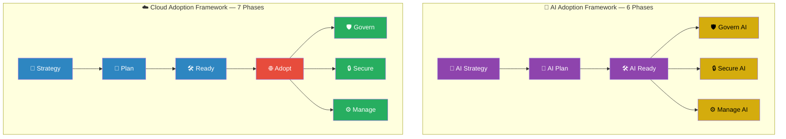
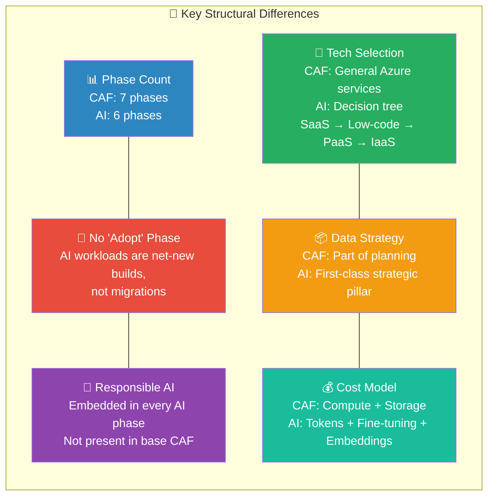

If you've spent any time in Azure-land, you know the **Cloud Adoption Framework (CAF)**. It's the playbook — seven phases that walk an organisation from "why cloud?" all the way to "how do I keep this thing running?" I've used it in dozens of engagements, and it remains one of the most practical artefacts Microsoft has ever published.

But here's what I keep getting asked in customer meetings: *"We get the cloud journey, but how does AI fit in? Is there a separate framework? Do we start over?"*

The short answer: **no, you don't start over.** Microsoft has published an **AI Adoption Framework** that lives *inside* the Cloud Adoption Framework as a scenario overlay. It follows the same structural philosophy — but it adds AI-specific concerns at every phase. Think of it as CAF with an AI lens bolted on.

This post is my side-by-side breakdown. I use it as a reference in workshops and strategy sessions, and now you can too.

---

## TL;DR — The Phase Map

| # | CAF Phase | AI Phase | Still the same? |
|---|-----------|----------|:-:|
| 1 | Strategy | AI Strategy | ≈ (AI adds use-case discovery, tech decision tree, responsible AI) |
| 2 | Plan | AI Plan | ≈ (AI adds PoC validation, AI-specific skills) |
| 3 | Ready | AI Ready | ≈ (AI adds architecture patterns, GPU provisioning) |
| 4 | Adopt | *(no separate phase)* | ✗ — adoption is merged into Plan & Ready |
| 5 | Govern | Govern AI | ≈ (AI adds model-specific risks, AI regulation) |
| 6 | Secure | Secure AI | ≈ (AI adds prompt injection, data poisoning threats) |
| 7 | Manage | Manage AI | ≈ (AI adds model lifecycle, token-based costs) |

> **Key takeaway:** The AI framework has **6 phases** vs. CAF's **7**. The "Adopt" phase disappears because AI workloads are overwhelmingly net-new builds, not migrations.

---

## Phase-by-Phase Comparison

### 1. Strategy → AI Strategy

| Dimension | Cloud Adoption Framework | AI Adoption Framework |
|-----------|--------------------------|----------------------|
| **Core question** | *Why are we moving to the cloud?* | *Which business problems should AI solve first?* |
| **Business alignment** | Map business drivers to cloud outcomes | Identify AI use cases anchored to quantified business objectives |
| **Technology selection** | General Azure service selection | AI-specific decision tree: SaaS Copilots → Low-code (Copilot Studio) → PaaS (Foundry) → IaaS (VMs / AKS) |
| **Data considerations** | Part of broader planning | First-class strategic concern — governance, lifecycle, lineage, bias detection |
| **Responsible AI** | Not addressed at this stage | Embedded from day one — principles, tooling, regulatory alignment |

**My take:** The AI Strategy phase is significantly heavier than its CAF counterpart. In customer engagements I find that the *use-case discovery* step alone — automation opportunities, customer feedback analysis, internal assessment, industry benchmarking — can take weeks. CAF Strategy is often a half-day workshop. AI Strategy is a multi-week programme.

---

### 2. Plan → AI Plan

| Dimension | Cloud Adoption Framework | AI Adoption Framework |
|-----------|--------------------------|----------------------|
| **Skills** | Cloud skills assessment and hiring plan | AI-specific skill gaps — ML engineering, prompt engineering, data science |
| **Resource access** | Azure subscription and service setup | Access AI resources (Foundry, OpenAI, Copilot licences) |
| **Validation** | Migration plan and cost estimation | Prioritise use cases → build a **proof of concept** before committing |
| **Responsible AI** | Not yet | Implement responsible AI tooling and processes |

**My take:** The PoC requirement is the biggest difference. In cloud migrations you can model costs and risks on paper. In AI, you *must* build something small to validate feasibility — model accuracy, latency, data quality — before writing the business case. I always push customers to run a 2–4 week spike here.

---

### 3. Ready → AI Ready

| Dimension | Cloud Adoption Framework | AI Adoption Framework |
|-----------|--------------------------|----------------------|
| **Environment** | Azure purchasing, tenant setup, landing zones | Build AI environment — Foundry workspace, model endpoints, GPU compute |
| **Architecture** | Platform and application landing zones | AI-specific architecture patterns: RAG, agents, fine-tuning pipelines |
| **Networking** | Standard Azure networking | AI networking considerations — private endpoints for model APIs, data plane isolation |
| **Reliability** | Standard HA/DR | AI reliability — model fallback, throttling, token-budget management |

**My take:** If you already have a solid landing zone, the AI Ready phase is about *extending* it — not rebuilding. The biggest new concern is GPU capacity planning and understanding the cost model (tokens, not just compute hours).

---

### 4. Adopt → *(merged)*

| Dimension | Cloud Adoption Framework | AI Adoption Framework |
|-----------|--------------------------|----------------------|
| **Phase exists?** | Yes — "Migrate, modernize, or build cloud-native workloads" | No separate phase |
| **Why?** | Cloud adoption often means moving *existing* workloads | AI workloads are predominantly **new builds**, not migrations |
| **Where did it go?** | N/A | Adoption activities are distributed across **AI Plan** (PoC) and **AI Ready** (build & deploy) |

**My take:** This is the most interesting structural difference. CAF Adopt exists because "lift and shift" is a real pattern in cloud. In AI there's (almost) nothing to lift and shift — you're building new capabilities. That said, I'd argue there's still room for an explicit "Adopt" gate that asks: *"Is this model ready for production?"* Maybe that's a future addition.

---

### 5. Govern → Govern AI

| Dimension | Cloud Adoption Framework | AI Adoption Framework |
|-----------|--------------------------|----------------------|
| **Risk scope** | Cloud resource risks — cost, compliance, sprawl | AI-specific risks — **bias, hallucination, model drift, shadow AI** |
| **Policy** | Azure Policy, management groups, tagging | AI governance policies — model registries, approval workflows, usage quotas |
| **Regulatory** | General cloud compliance (SOC 2, ISO 27001, etc.) | AI-specific regulation — **EU AI Act, NIST AI RMF**, industry-specific rules |
| **Tooling** | Azure Policy, Microsoft Defender for Cloud | Microsoft Purview DSPM for AI, Responsible AI Dashboard, AI CoE |

**My take:** Governance is where the frameworks diverge the most in *substance*. Cloud governance is largely about infrastructure controls. AI governance is about *behaviour* controls — what can the model say, who approved this prompt template, how do we detect drift. If a customer doesn't have an AI Center of Excellence yet, this is where I start that conversation.

---

### 6. Secure → Secure AI

| Dimension | Cloud Adoption Framework | AI Adoption Framework |
|-----------|--------------------------|----------------------|
| **Threat surface** | Traditional cloud threats — identity, network, data | AI-specific threats — **prompt injection, data poisoning, model theft, adversarial inputs** |
| **Protection** | NSGs, firewalls, encryption, IAM | All the above + **content filtering, grounding controls, red-teaming AI models** |
| **Detection** | Microsoft Defender, Sentinel | AI-specific threat detection — anomalous token usage, jailbreak attempts |

**My take:** Most security teams I work with are still catching up to AI-specific threats. Prompt injection alone is a category that didn't exist two years ago. I always recommend running an **AI red-team exercise** before going to production — Microsoft has published tooling and guidance for this.

---

### 7. Manage → Manage AI

| Dimension | Cloud Adoption Framework | AI Adoption Framework |
|-----------|--------------------------|----------------------|
| **Operations** | Standard cloud ops — monitoring, patching, scaling | AI ops — **model versioning, A/B testing, retraining pipelines, evaluation loops** |
| **Cost management** | Compute + storage costs | **Token-based cost management** — input/output tokens, fine-tuning compute, embedding storage |
| **Data** | Standard data lifecycle | AI data pipeline operations — training data freshness, RAG index updates, data lineage |
| **Business continuity** | DR and backup | Model fallback strategies, multi-model architectures, graceful degradation |

**My take:** Managing AI workloads is fundamentally different from managing VMs and databases. The cost model alone requires new tooling and new instincts — a single prompt can cost anywhere from fractions of a cent to several dollars depending on the model and context window. I've seen customers get surprised by bills because nobody was tracking token consumption.

---

## Key Structural Differences — Visualised

> **Legend:** Blue = CAF foundational · Red = "Adopt" (absent in AI) · Green = CAF operational · Purple = AI foundational · Gold = AI operational

---

## Summary Table

| Aspect | Cloud Adoption Framework | AI Adoption Framework |
|--------|--------------------------|----------------------|
| **Phases** | 7 (Strategy → Plan → Ready → Adopt → Govern → Secure → Manage) | 6 (Strategy → Plan → Ready → Govern → Secure → Manage) |
| **Flow** | Sequential foundation → parallel operations | Same, but with stronger iterative feedback loops |
| **"Adopt" phase** | Migrate / modernise / build | Absent — adoption is distributed across Plan and Ready |
| **Responsible AI** | Not a standalone concern | Embedded in **every** phase |
| **Tech selection** | General Azure services | AI decision tree (SaaS → Low-code → PaaS → IaaS) |
| **Data strategy** | Part of broader planning | First-class strategic concern with governance, lineage, and bias detection |
| **Cost model** | Compute + storage | Tokens, fine-tuning compute, embedding storage, licences |
| **Target workloads** | All cloud workloads | AI-specific (generative AI, analytical AI, ML) |
| **Audience** | Startups to enterprise | Same — with separate checklists per maturity |

---

## Bottom Line

The AI Adoption Framework isn't a replacement for CAF — it's a **specialised overlay**. If you've already built your cloud foundation using CAF, you're ahead of the game. The AI framework extends that foundation with AI-specific concerns: responsible AI governance, model lifecycle management, AI-specific security threats, and a technology decision tree for choosing between Copilots, Foundry, and custom IaaS solutions.

The most important thing I tells customers: **don't skip AI Strategy**. The temptation is to jump straight to "let's spin up an OpenAI endpoint." But the organisations that succeed with AI are the ones that start with a quantified use case, validate it with a PoC, and *then* build — with governance, security, and cost controls baked in from day one.

Start with Strategy. Always.

---

*Sources: [Cloud Adoption Framework Overview](https://learn.microsoft.com/en-us/azure/cloud-adoption-framework/overview) · [AI Adoption Framework — Strategy](https://learn.microsoft.com/en-us/azure/cloud-adoption-framework/scenarios/ai/strategy) · [AI Adoption Overview](https://learn.microsoft.com/en-us/azure/cloud-adoption-framework/scenarios/ai/)*
