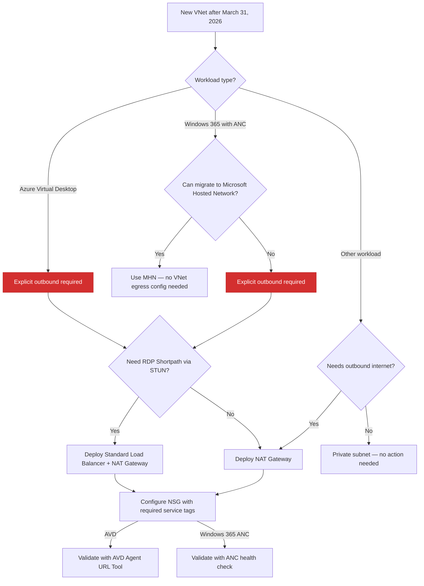

## TL;DR

On **March 31, 2026**, newly created Azure Virtual Networks will default to **private subnets** — meaning no implicit outbound internet access. If you run **Azure Virtual Desktop (AVD)** or **Windows 365 with Azure Network Connections (ANC)**, your session hosts require outbound connectivity to function. Without explicit outbound access, **provisioning will fail** and **existing session hosts on new VNets will lose connectivity** to critical services like Windows activation, agent updates, and RDP brokering.

This post provides:
1. A clear explanation of what is changing and why
2. The impact on AVD and Windows 365 ANC deployments
3. A modular **PowerShell tool** to audit your subscriptions and deploy remediation

---

## What Is Default Outbound Access?

Default Outbound Access (DOA) is Azure's legacy behavior that allowed all resources in a virtual network to reach the public internet **without configuring a specific internet egress path**. Azure assigned a platform-managed outbound IP to VMs — an IP you didn't own, couldn't predict, and that could change without notice.

This implicit access allowed telemetry, Windows activation, certificate checks, and other service dependencies to reach external endpoints even when no explicit outbound connectivity method was configured.

### Why is Azure retiring it?

Microsoft is retiring DOA because:

| Concern | Detail |
|---|---|
| **Security** | Default internet access contradicts Zero Trust principles |
| **Clarity** | Explicit connectivity is always preferred over implicit access |
| **Stability** | The default outbound IP isn't customer-owned and can change; platform updates may affect behavior |
| **Consistency** | Multiple NICs on a VM can yield inconsistent outbound IPs; VMSS instances may get different IPs |

---

## What Exactly Is Changing?

After **March 31, 2026**:

- **New VNets** created via any method (Portal, ARM, Bicep, Terraform, CLI, PowerShell) using the latest API versions will have `defaultOutboundAccess = false` on their subnets by default — making them **private subnets**.
- **Existing VNets are NOT affected.** Both existing VMs and newly created VMs in existing VNets continue to have default outbound access unless you manually disable it.
- VMs in private subnets **cannot reach the internet** unless an explicit outbound method is configured.

> ⚠️ If you use older ARM template API versions or tools like Terraform pinned to older provider versions, `defaultOutboundAccess` may remain `null` (implicitly allowing outbound). Don't rely on this — it is not a long-term strategy.

---

## Impact on Azure Virtual Desktop

AVD session hosts require outbound connectivity to a set of mandatory FQDNs and endpoints. Without outbound access, the following **will break**:

| Dependency | Protocol | Port | Why It Matters |
|---|---|---|---|
| `login.microsoftonline.com` | TCP | 443 | Authentication to Microsoft Online Services |
| `*.wvd.microsoft.com` | TCP | 443 | Service traffic including TCP-based RDP |
| `51.5.0.0/16` | UDP | 3478 | Relayed RDP connectivity (TURN/STUN) |
| `catalogartifact.azureedge.net` | TCP | 443 | Azure Marketplace (image deployment) |
| `*.prod.warm.ingest.monitor.core.windows.net` | TCP | 443 | Diagnostics / Agent telemetry |
| `gcs.prod.monitoring.core.windows.net` | TCP | 443 | Agent traffic |
| `azkms.core.windows.net` | TCP | 1688 | **Windows activation** |
| `mrsglobalsteus2prod.blob.core.windows.net` | TCP | 443 | Agent and SXS stack updates |
| `wvdportalstorageblob.blob.core.windows.net` | TCP | 443 | Azure portal support |
| `169.254.169.254` | TCP | 80 | Azure Instance Metadata Service (IMDS) |
| `168.63.129.16` | TCP | 80 | Session host health monitoring |
| `oneocsp.microsoft.com` | TCP | 80 | Certificate validation |
| `*.service.windows.cloud.microsoft` | TCP | 443 | Service traffic |
| `*.windows.cloud.microsoft` | TCP | 443 | Service traffic |

**If any of these are unreachable, your session hosts will not register, will not activate Windows, and users cannot connect.**

---

## Impact on Windows 365 ANC Deployments

Windows 365 customers using **Azure Network Connection (ANC)** are directly affected:

- **New VNets created after March 31** will default to private subnets
- **Cloud PC provisioning will fail** if the VNet has no explicit outbound access
- **ANC health checks will fail** because the VNet cannot reach required endpoints
- **Microsoft-hosted network (MHN) deployments are NOT affected** — Microsoft manages egress for those

### Microsoft's recommendation

> *"Transition to Microsoft-hosted network (MHN) if possible. MHN provides secure, cost-effective connectivity with outbound internet access by default, reducing operational overhead."*
>
> — [Microsoft Tech Community, Feb 2026](https://techcommunity.microsoft.com/discussions/windows365discussions/azure-default-outbound-access-changes-guidance-for-windows-365-anc-customers/4494460)

If MHN is not an option, configure explicit outbound access using one of the supported methods below.

---

## Supported Outbound Access Methods

| Method | Recommended? | Notes |
|---|---|---|
| **Azure NAT Gateway** | ✅ Recommended | Simple, scalable, no UDR needed. Does NOT support STUN-based UDP hole punching (RDP Shortpath via STUN will fall back to TURN relay). |
| **Azure Standard Load Balancer** | ✅ Supported | Supports UDP over STUN. Requires outbound rules. |
| **Azure Firewall / NVA** | ⚠️ Supported with caveats | Do NOT route RDP or long-lived connections through Azure Firewall — scale-in events can drop sessions. Use a direct method (NAT Gateway) for RDP alongside Firewall for filtering. |
| **Standard Public IP on VM** | ⚠️ Supported | Assigning a public IP directly exposes the VM. Not recommended for AVD session hosts. |

### A word on RDP Shortpath

If you use **RDP Shortpath (UDP over STUN)**, be aware that NAT Gateway uses symmetric NAT which **prevents STUN-based direct UDP connectivity**. The connection will fall back to **TURN relay**, which still works but routes through Microsoft's relay infrastructure. If you need direct STUN, use an **Azure Standard Load Balancer** instead.

---

## The Decision Framework for Windows 365 and Azure Virtual Desktop



---

## Auditing Your Environment

Before remediating, you need to know where you stand. The PowerShell tool included with this post scans all VNets in a subscription and identifies subnets that lack explicit outbound access.

### What the tool checks

For each subnet in every VNet, the tool evaluates:

| Check | What it looks for |
|---|---|
| **NAT Gateway** | Is a NAT Gateway associated with the subnet? |
| **Azure Firewall** | Is the subnet delegated to or associated with an Azure Firewall? |
| **Public IP on NIC** | Do any NICs in the subnet have a public IP? |
| **Load Balancer** | Are any NICs in the subnet part of a Standard Load Balancer backend pool with outbound rules? |
| **UDR to NVA** | Does the route table have a default route (0.0.0.0/0) pointing to a Virtual Appliance? |

Subnets without any of these are flagged as **having no explicit outbound access**.

### Running the tool

```powershell
# Audit mode — scan and visualize
.\Invoke-AzOutboundAccessTool.ps1

# Deploy NAT Gateway to an existing subnet
.\Invoke-AzOutboundAccessTool.ps1

# Deploy a new VNet with NAT Gateway attached
.\Invoke-AzOutboundAccessTool.ps1

# Deploy AVD-ready NSGs
.\Invoke-AzOutboundAccessTool.ps1
```

The tool is interactive and menu-driven. See the full script in the repository: [`Invoke-AzOutboundAccessTool.ps1`](https://github.com/benmartinbaur/benmartinbaur.github.io/blob/main/content/posts/2026-03-13-azure-default-outbound-access-avd/Invoke-AzOutboundAccessTool.ps1).

---

## Remediation: What the Tool Can Deploy

### 1. NAT Gateway on an Existing Subnet

The tool can deploy a NAT Gateway with a Public IP and associate it with an existing subnet. This is the simplest path to compliance for existing VNets.

### 2. New VNet with NAT Gateway

For greenfield deployments, the tool creates a new VNet with a subnet, NAT Gateway, and Public IP — ready for AVD session hosts.

### 3. NSGs with AVD Required Endpoints

The tool can deploy a Network Security Group pre-configured with outbound rules for all mandatory AVD FQDNs and service tags:

| Service Tag / Destination | Port | Protocol | Purpose |
|---|---|---|---|
| `AzureActiveDirectory` | 443 | TCP | Authentication |
| `WindowsVirtualDesktop` | 443 | TCP | AVD service traffic |
| `WindowsVirtualDesktop` | 3478 | UDP | RDP relay (TURN) |
| `AzureMonitor` | 443 | TCP | Diagnostics |
| `AzureCloud` | 443 | TCP | Portal, management |
| `AzureFrontDoor.Frontend` | 443 | TCP | Marketplace |
| `Internet` | 1688 | TCP | Windows KMS activation |
| `Internet` | 80 | TCP | Certificates (OCSP, CRL) |
| `Storage` | 443 | TCP | Agent updates |

> ⚠️ The NSG rules use Azure **Service Tags** wherever possible. Service tags are automatically updated by Microsoft when IP ranges change — you do not need to maintain IP lists manually.

> ⚠️ **Read** and **Test** before apply and run in **production**

---

## What You Should Do Right Now

| # | Action | Priority |
|---|---|---|
| 1 | **Audit** all subscriptions with the PowerShell tool to identify subnets without explicit outbound | 🔴 Critical |
| 2 | **Plan** explicit outbound (NAT Gateway recommended) for any VNet that will host AVD/W365 session hosts | 🔴 Critical |
| 3 | **Test** connectivity after deploying NAT Gateway using the [AVD Agent URL Tool](https://learn.microsoft.com/en-us/azure/virtual-desktop/check-access-validate-required-fqdn-endpoint) | 🟡 High |
| 4 | **Evaluate** Microsoft Hosted Network for Windows 365 to eliminate ANC egress management | 🟡 High |
| 5 | **Document** your outbound architecture and NSG rules for compliance and operational clarity | 🟢 Standard |
| 6 | **Communicate** to your teams that new VNet deployments after March 31 will need explicit outbound as part of provisioning | 🟢 Standard |

---

## References

- [Default outbound access in Azure](https://learn.microsoft.com/en-us/azure/virtual-network/ip-services/default-outbound-access)
- [Required FQDNs and endpoints for Azure Virtual Desktop](https://learn.microsoft.com/en-us/azure/virtual-desktop/required-fqdn-endpoint?tabs=azure)
- [Use Azure Firewall to protect Azure Virtual Desktop](https://learn.microsoft.com/en-us/azure/firewall/protect-azure-virtual-desktop)
- [Azure Default Outbound Access Changes: Guidance for Windows 365 ANC Customers](https://techcommunity.microsoft.com/discussions/windows365discussions/azure-default-outbound-access-changes-guidance-for-windows-365-anc-customers/4494460)
- [Windows 365 Network Requirements](https://learn.microsoft.com/en-us/windows-365/enterprise/requirements-network?tabs=enterprise%2Cent#allow-network-connectivity)
- [QuickStart: Create a NAT Gateway](https://learn.microsoft.com/en-us/azure/nat-gateway/quickstart-create-nat-gateway)
- [Azure Firewall Policy Sample for AVD](https://github.com/Azure/RDS-Templates/tree/master/AzureFirewallPolicyForAVD)

---

*Have questions or feedback? Find me on [LinkedIn](https://www.linkedin.com/in/benmartinbaur/).*
