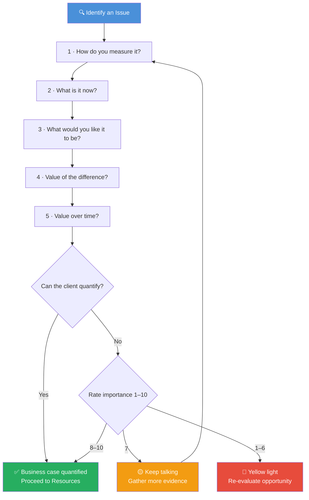
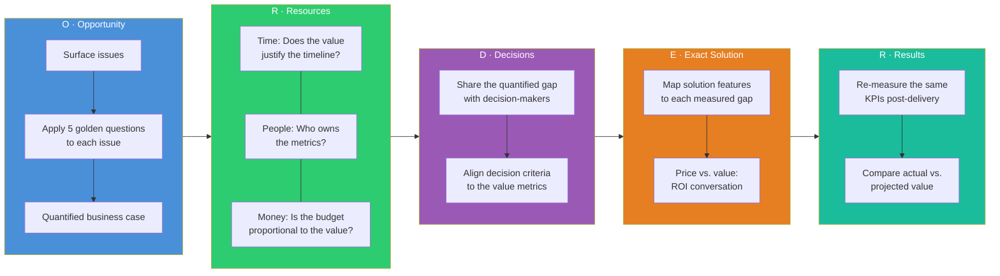

# Let’s Get Real or Let’s Not Play – a Consultant Checklist 
*Based on Transforming the Buyer/Seller Relationship”** by Mahan Khalsa and Randy Illig*

*This checklist is structured around the major chapters and stages of the ORDER methodology – **Opportunity**, **Resources**, **Decisions**, **Exact/Enable Decisions**, **Results** – preceded by the key beliefs that underpin the approach.  Each section suggests questions a consultant should ask a client (and themselves) to ensure both parties understand whether it makes sense to proceed.*

## TL;DR

| Stage | Area | Key Question |
|-------|------|-------------|
| **Mind‑set** | Intent | *Am I genuinely seeking to help the client succeed?* |
| | Value | *What problem are we solving? What results matter most?* |
| | Readiness | *Do I understand their situation well enough to propose anything?* |
| **Qualifying** | Clarity | *What does "[term]" mean to you in this context?* |
| | Yellow lights | *I have a concern… What do you think should happen next?* |
| **O – Opportunity** | Issues | *What problems or results are you trying to address right now?* |
| | Completeness | *What else? Which is most important to address first?* |
| | Evidence | *How do you measure it? What is it now? What would you like it to be?* |
| | Impact | *What is the value of the difference? What is the value over time?* |
| | Context | *Who else is affected? What has prevented you from fixing it?* |
| | Urgency | *Why address this now? What would success look like?* |
| **R – Resources** | Time | *By when do you need results? Are there critical milestones?* |
| | People | *Who will implement and use this? May we access key stakeholders?* |
| | Money | *How do you typically fund this? What would success be worth?* |
| | Priorities | *What other initiatives compete for the same resources?* |
| **D – Decisions** | Who | *Who makes the final decision? Who influences, vetoes, or signs?* |
| | Criteria | *What criteria define a "yes"? How will you define success?* |
| | Process | *What is the decision process? By when do you expect to decide?* |
| | Competition | *Who else are you evaluating? Is "do nothing" an option?* |
| | Access | *Could we meet the key stakeholders you mentioned?* |
| **E – Exact Solution** | Fit | *Does this solution address the issues and criteria we discussed?* |
| | Concerns | *What concerns or questions do you have?* |
| | Price | *How does our price fit with the value you expect to receive?* |
| | Next steps | *What do you need to see before making a decision?* |
| **R – Results** | Outcome | *How have the results compared to the goals we set?* |
| | Growth | *What other challenges are surfacing that we could address?* |
| | Referral | *Would you be willing to recommend us to others?* |

### The Five Golden Questions – How to Use Them

The five golden questions are the core tool for turning a vague problem into a quantified business case. Use them **sequentially** on each issue the client raises — the output is either a concrete value gap or a clear signal to stop.

| # | Question | What You Learn | Example |
|---|----------|---------------|---------|
| 1 | *How do you measure it?* | The metric or KPI that matters | "We track customer churn rate monthly." |
| 2 | *What is it now?* | Current baseline performance | "We're at 8 % monthly churn." |
| 3 | *What would you like it to be?* | The desired target state | "We'd like to get it below 3 %." |
| 4 | *What is the value of the difference?* | The monetary or strategic gap | "Each point of churn ≈ €200 K/year in lost revenue." |
| 5 | *What is the value over time?* | Compounded long‑term impact | "Over 3 years that's €3 M+ in retained revenue." |

**If the client can't quantify:** Ask them to rate the importance of the issue on a 1–10 scale:
- **8–10** → High motivation – proceed with confidence.
- **7** → Enough to keep talking – dig deeper.
- **1–6** → Yellow light – reconsider whether this is a real opportunity.

### Five Golden Questions × ORDER – When to Use Them at Each Stage

The five golden questions are born in the **Opportunity** stage, but they echo through every subsequent stage. Here's how they connect:

| ORDER Stage | How the 5 Golden Questions Feed In | What to Do |
|-------------|-----------------------------------|------------|
| **O – Opportunity** | *Primary home.* Ask all five questions per issue to build the quantified business case. | Surface every issue → run each through the 5 questions → rank by value. |
| **R – Resources** | Use the value numbers to **reality‑check resources.** If the gap is €3 M but the budget is €50 K, that's a yellow light — either the value is overstated or the budget is too low. | Ask: *"Given the value we identified (Q4/Q5), does the proposed budget / timeline make sense?"* |
| **D – Decisions** | Share the quantified gap with every decision‑maker. The metrics from Q1–Q3 become **shared decision criteria**. | Ask: *"Would you agree that moving [metric] from [current] to [target] is the right success criterion?"* |
| **E – Exact Solution** | Map each solution feature back to a specific measured gap. Price is justified by comparing cost to the value of the difference (Q4) and value over time (Q5). | Ask: *"This component addresses [metric]. The value gap is [€X]. Does our price feel proportional?"* |
| **R – Results** | After delivery, **re‑ask Q1–Q3** using the same KPIs. Compare actual results to the projected value from Q4/Q5. | Ask: *"When we started, [metric] was at [X]. Where is it now? How does that compare to the [€Y] value we projected?"* |

> **Rule of thumb:** If you can't answer Q4 (*value of the difference*) with a number the client agrees on, you don't yet have a real opportunity — loop back to Opportunity before spending time on Resources or Decisions.

## 1  Key beliefs – Mind‑set before engaging clients

- **Intent matters more than technique** – Ask yourself: *Am I genuinely seeking to help the client succeed rather than focusing on my own quotas?* The authors stress that trust arises from a combination of intent and expertise.  Wondering about the client’s numbers helps build trust and prevents premature solutioning.
- **Clients and consultants want the same thing** – Both sides want a solution that truly meets the client’s needs.  Ask: *How will my services help them achieve their goals?*  
- **Solutions have no inherent value** – The value of any solution comes from the problems it solves and results it delivers. Ask: *What problem are we solving? What results will matter most to the client?*
- **World‑class inquiry precedes world‑class advocacy** – Ask before telling. Clarify and explore before recommending. Ask: *Do I understand their situation well enough to propose anything?*  
- **“No guessing” and “Slow down for yellow lights”** – Don’t assume meanings; clarify ambiguous terms and address doubts or “yellow lights” with tact..  Ask: *What does this term mean to you?* and when concerns arise: “I have a concern… here is my understanding … what do you think we should do?”.

## 2  Qualifying – Overview: Should we keep talking?

**Guiding principles**:

1. **Eliminate guessing** – Clarify client terminology and context. For any unclear term (e.g., “flexible solution”), ask: “*What does “flexible” mean to you in this context?*”. Use similar language as the client and feed back their words.
2. **Address yellow lights** – If you sense doubt or concerns (yours or theirs), vocalise them respectfully.  Use the three‑step response: “*I have a concern…* (state the confusion or potential problem) … *What do you think should happen next?*”.  
3. **Understand unspoken meaning** – Listen for what is not being said, observe non‑verbal signals and metaphors.

## 3  Qualifying Opportunities – **Opportunity**

**Focus:** Determine if there is a real opportunity by exploring issues, evidence, impact, context and constraints.

1. **Move off the solution** – Early in the conversation, avoid discussing specific solutions; instead explore the problem. Ask: *“What problems or results are you trying to address right now?”*
2. **Get out all of the issues** – Ask open questions to surface every issue: *“What else?”* until no new issues emerge.  Prioritise them by asking: *“Which of these is most important to address first?”*.
3. **Gather evidence and impact** – Use the **five golden questions** to quantify or strongly qualify the problem:
   - **How do you measure it?** (metrics or KPIs).  
   - **What is it now?** (current performance).  
   - **What would you like it to be?** (desired state).  
   - **What is the value of the difference?** (monetary or strategic impact).  
   - **What is the value over time?** (long‑term impact).  
   If the client cannot quantify, ask them to rate importance on a 1–10 scale; 8–10 means high motivation, 7 is enough to keep talking, 1–6 is a yellow light.
4. **Explore context and constraints** – Ask: *“Who else is affected by this issue?”* and *“What has prevented you from fixing it in the past?”*.  Probe typical constraints such as lack of budget, inability to secure executive buy‑in, vested interests, organisational politics, complexity or competing priorities.  Follow up with: *“What is different this time that will allow success?”*.  
5. **Confirm opportunity and intent** – Ask: *“Why address this now?”* and *“What would success look like if we solve it?”*.  If you detect that they just need a price check or are not committed, treat it as a yellow light and clarify your role.

## 4  Qualifying Resources – **Resources**

**Purpose:** Determine whether the client has adequate time, people, and money to pursue the opportunity.

1. **Time** – Ask:  
   - *“By when would you like to have these results in place?”*.  
   - *“When were you hoping to start?”*.  
   - *“Are there critical milestones or events driving this timeline?”*  
   If the timeframe is unrealistic, treat as a yellow light and explore alternatives.
2. **People** – Ask:  
   - *“Who will be involved in implementing and using this solution?”*.  
   - *“Who else needs to be consulted?”*.  
   - *“May we get access to the key stakeholders to understand their perspectives?”*.  Lack of access is a yellow light.
3. **Money/Budget** – Remember at this stage you discuss **value**, not price. Ask:  
   - *“How do you typically fund projects like this?”*.  
   - *“How did you arrive at your budget number?”*.  
   - *“What would success be worth to your organisation?”*.  
   If they ask for price prematurely, respond by explaining you need to understand whether it makes sense to proceed before quoting..  
4. **Competing priorities** – Ask: *“What other initiatives might compete for the same resources?”*.  This helps reveal constraints and ensures alignment.

## 5  Qualifying Decisions – **Decisions**

**Aim:** Understand how the client will decide and who will decide.

1. **Decision roles** – Ask:  
   - *“Who will make the final decision?”*.  
   - *“Who else influences the decision?”*.  
   - *“Who can veto or block it?”*.  
   - *“Who signs the contract or check?”*.  
   - *“Who must approve the funding?”*.
2. **Decision criteria** – Ask:  
   - *“What will your criteria be for a ‘yes’ decision?”*.  
   - *“How will you define success?”*.  
   - *“What criteria will you use in selecting a provider?”*.  
   - *“What does an ideal implementation look like for you?”*.  
3. **Decision process and timeline** – Ask:  
   - *“What is the process for making this decision?”*.  
   - *“What steps need to be followed and in what order?”*.  
   - *“By when do you expect to decide?”*.  
4. **Competition and status quo** – Ask:  
   - *“Who else are you considering or evaluating?”*.  
   - *“Are you currently working with an incumbent provider? Why consider changing?”*.  
   - *“How do we compare to other options?”*.  
   - *“Is there a chance you will choose to do nothing?”*.  This reveals whether the opportunity is real or a price check.
5. **Stakeholder access** – Verify you can meet key stakeholders: *“Could we meet the people you mentioned to understand their needs?”*  If they refuse or limit access, highlight it as a yellow light.
6. **Mapping roles** – Work with the client to map each person’s role (initiator, gatekeeper, champion, influencer, user, decision‑maker, ratifier) and plan how to involve each.

## 6  Winning – Enabling Decisions (**Exact Solution/Enable Decisions**)

When the opportunity, resources and decision process are qualified, you may prepare an **Exact Solution** (proposal) and facilitate the decision process.  The goal is to confirm that your solution fits and to enable a clear “yes/no/next step” decision.

1. **Do not present until ready** – Ensure you thoroughly understand the client’s needs and decision criteria before presenting.
2. **Meeting plan** – Structure the presentation using the following elements:
   - **End in Mind** – Be clear about the objective; for example, “by the end of this meeting we should both know whether this is a good fit and, if so, agree on next steps.”  
   - **Key beliefs** – Identify the core beliefs the client must hold to choose you (e.g., confidence in your competence, trust in your intent, belief that your solution is the right fit).  
   - **Proof and actions** – Determine what proof (case studies, demonstrations, pilot results) or actions will substantiate those beliefs.  
   - **Questions** – Plan the questions you will ask to validate needs and to engage the client; anticipate questions they will ask you.  
   - **Yellow lights** – Anticipate potential concerns (e.g., price, change management) and how you will address them.  
   - **Next steps & agenda** – Agree on what will happen if the meeting is successful (contract review, pilot, executive meeting) and outline the agenda to the client.
3. **During the presentation** – Ask:  
   - *“Does this solution address the issues and criteria we discussed?”*.  
   - *“What concerns or questions do you have?”*.  
   - *“Are there any decision criteria we have not met? If so, can we change the criterion or demonstrate that it is not critical?”*.  
   - *“How does our price fit with the value you expect to receive?”* (discuss price last; negotiate only when the business case is clear).  
   - *“What will you need to see or discuss before making a decision?”*  
4. **Close and next steps** – Summarise agreements, confirm if the client will move forward, and schedule follow‑up actions. If not a fit, walk away respectfully.

## 7  Initiating New Opportunities

This stage is about prospecting and deciding whether you should be talking with a potential client.

1. **Prioritise prospects** – Focus on the most promising potential clients rather than cold calling everyone. Use referrals and research to identify organisations likely to have the issues you solve.
2. **Prepare a business case hypothesis** – Before contacting, develop a preliminary hypothesis about the client’s situation, possible solution and the potential value.  This shows respect for their time.
3. **First contact questions** – In your introductory call or message, resolve the question “should we be talking?”  Ask succinctly:  
   - *“We work with organisations experiencing [issue]. Is this something you are facing?”*.  
   - *“If the issue isn’t on your radar, may I ask if it’s because it is not a priority, you don’t have time right now, or you have it covered?”*.  
4. **Qualify or disengage** – If they are not experiencing the problem, or if timing or resources are not right, thank them and disengage.  If they are interested, move into a full Opportunity conversation.

## 8  Delivering and Reviewing Results – **Results**

After implementation, revisit the client to measure outcomes and explore further opportunities.

- **Measure results** – Ask: *“How have the results compared to the goals we set?”*.  
- **Identify additional needs** – Ask: *“What other challenges are surfacing that we could address?”*.  
- **Seek feedback and referrals** – Ask: *“How could we improve our partnership?”* and *“Would you be willing to recommend us to others?”*.  This stage solidifies long‑term relationships and may initiate another cycle of the ORDER model.

## Conclusion

This checklist operationalises the principles from **Let’s Get Real or Let’s Not Play**.  By following the ORDER model—Opportunity, Resources, Decisions, Exact Solution (& Results)—and by embracing the key beliefs of trust, client focus and world‑class inquiry, consultants can transform the buyer/seller relationship into a collaborative process centred on helping clients succeed.
