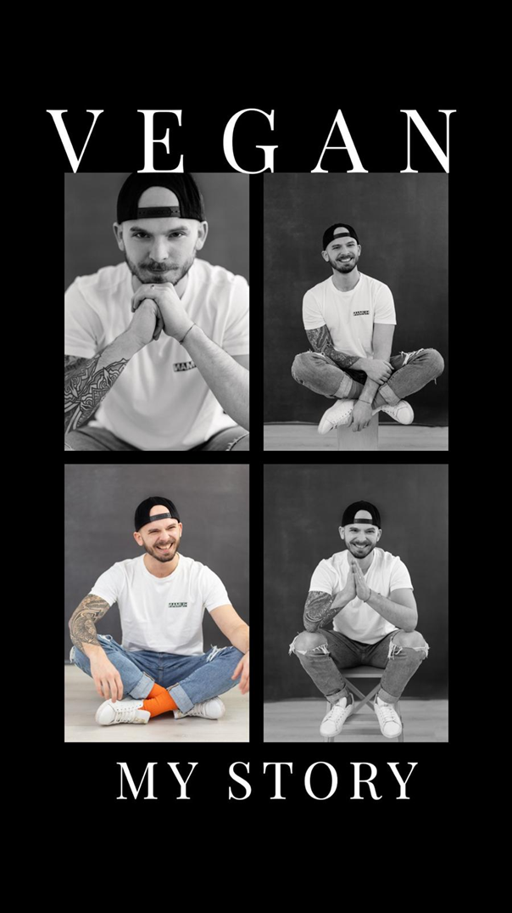

# VEGAN – MY STORY

When I first embraced veganism with my wife, it wasn’t because someone told me I should. It wasn’t because of a trend or a fleeting guilt after watching a documentary. We were in Australia and out of a sudden we noticed that there were hundreds of plat-based options, even in the most remote location, there was a plat-based option. A t the same time it was fairly hard to travel with fresh animal products in a campervan. So we though, let’s try this!

Welcome to the rabbit-hole. At the same time I started to read a lot about physical performance, nutrition and overall wellbeing and realized something essential about myself: My values couldn’t align with a system that profits from suffering, environmental degradation, and inefficiency. The more I learned, the less I could justify looking the other way. 
And one of my core values in every aspect of life is to stay brutally honest and true to myself and who I am.

It wasn’t an easy journey, but it was a conscious one. I chose to focus on what I could control, staying within my circle of influence. I couldn’t single-handedly change every policy or reverse decades of environmental harm, but I could change what was on my plate. Each choice I made—each meal—became a small but deliberate act of care. For myself. For the animals. For the planet.

I hit refresh. When I joined Microsoft this quote inspired me, to hit refresh every day. Every day, I make the same decision: to reduce harm, to nourish myself without exploitation, and to contribute to a sustainable future. Each day brings new challenges, but also a renewed opportunity to align my actions with my values.

It’s not just about ethics; it’s about economics. A plant-based diet is one of the simplest yet most profound ways to mitigate climate change. Livestock farming uses nearly 80% of agricultural land while contributing only 18% of global calories. The inefficiency is staggering. By shifting to plant-based systems, we could feed billions more people, reduce water waste, and slash greenhouse gas emissions. The data doesn’t just support veganism; it demands it.

Ultimately, veganism isn’t just a diet—it’s a declaration. It’s saying, "I choose to see the world as interconnected. I choose to act on that knowledge." Every meal is a vote for the kind of world I want to live in, the kind of world I want to leave behind.

Change is hard. But staying the same has consequences. **If you don’t change it, you choose it.**
