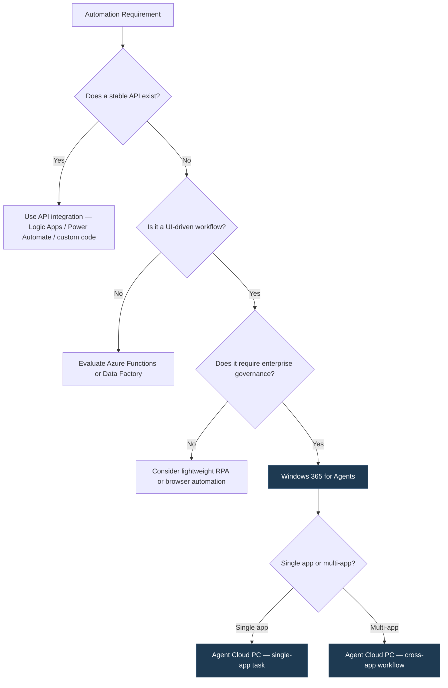

## TL;DR

| What | Detail |
|---|---|
| **The problem** | Most enterprise automation stalls at UI-driven legacy apps where APIs are incomplete or don't exist |
| **What's new** | Windows 365 for Agents gives AI agents their own Cloud PCs — full desktop sessions with enterprise identity, Intune management, and policy enforcement |
| **How it works** | Agent 365 governs *what* agents can do; Windows 365 for Agents defines *where* they execute — inside a managed, auditable Cloud PC |
| **Why it matters** | Same Entra ID, Conditional Access, and compliance controls you apply to human users now apply to agent sessions |
| **Who should care** | Enterprise architects, IT admins, and automation teams running UI-dependent workflows at scale |

---

## Why This Matters

Here's an uncomfortable truth about enterprise automation: the most critical business workflows still live behind UIs that nobody ever built APIs for.

Expense approvals. Insurance claim adjudication. ERP transactions. Mainframe green-screen bridges wrapped in a Windows app. These are the processes that keep organizations running — and they've been almost untouchable by modern automation because the business logic lives in the interface itself. Warnings, conditional flows, approval chains, exception handling — it's all in the UI, not behind a REST endpoint.

Traditional RPA tried to solve this by scripting mouse clicks and keystrokes on virtual machines. It worked — until it didn't. Brittle selectors broke on every UI update. Scaling meant spinning up more unmanaged VMs. And governance? Most RPA bots ran on infrastructure that existed outside the enterprise identity and compliance stack entirely.

Windows 365 for Agents changes the equation. Instead of bolting automation onto unmanaged infrastructure, AI agents now get their own Cloud PCs — Entra ID-joined, Intune-managed, Conditional Access-enforced, and auditable by design. The agent operates in the same trust boundary as your human workforce.

When I led the largest Windows 365 deployments globally — 75,000+ Cloud PCs across some of the world's most regulated enterprises — the question I heard most often wasn't about licensing or sizing. It was: *"How do we extend this to automated workloads without losing governance?"* That question now has an answer.

---

## What Makes Windows 365 for Agents Different from Traditional RPA

This isn't RPA with a new label. The architecture is fundamentally different.

| Capability | Traditional RPA | Windows 365 for Agents |
|---|---|---|
| **Runtime environment** | Dedicated VMs or local desktops, often unmanaged | Full Cloud PC — provisioned, patched, and decommissioned like any managed endpoint |
| **Identity** | Service accounts or shared credentials | Entra ID identity per agent — same identity plane as human users |
| **Policy enforcement** | Bolt-on or absent | Intune device compliance, Conditional Access, app protection policies — native |
| **UI interaction model** | Pixel-matching, brittle selectors, coordinate-based clicks | AI-driven visual understanding — agents *see* the UI and reason about it |
| **Scaling** | Manual VM provisioning or dedicated infrastructure | Elastic Cloud PC provisioning via Windows 365 APIs |
| **Auditability** | Custom logging, if any | Enterprise audit trail — sign-in logs, compliance state, device inventory |
| **Multi-app workflows** | Typically single-application per bot | Agents navigate across applications and browsers within the same session |
| **Update resilience** | Scripts break on UI changes — requires manual selector maintenance | AI-driven visual understanding is significantly more resilient to layout changes than hardcoded selectors — though not infallible, it reduces maintenance dramatically |
| **Governance model** | Separate from endpoint management | Unified with your existing Microsoft endpoint management stack |
| **Lifecycle management** | Persistent VMs that accumulate drift | Stateless or policy-managed Cloud PCs — reprovision cleanly |

The key shift: **RPA automated tasks. Windows 365 for Agents automates work.** The difference is that an AI agent doesn't follow a script — it reasons about what's on screen, decides what to do next, and completes multi-step workflows that span multiple applications. And it does all of this inside a managed, compliant environment.

---

## How It Works — The Architecture

Windows 365 for Agents introduces a clean separation between orchestration and execution:

```
┌─────────────────────────────────────────────────────────┐
│                    Agent 365 (Orchestration)             │
│  Defines WHAT agents can do: tasks, permissions, scope  │
│  GA: May 1, 2025                                        │
└──────────────────────────┬──────────────────────────────┘
                           │
                           ▼
┌─────────────────────────────────────────────────────────┐
│              Windows 365 for Agents (Execution)         │
│  Defines WHERE agents execute: Cloud PC runtime         │
│  Full Windows desktop · Entra ID joined · Intune managed│
└──────────────────────────┬──────────────────────────────┘
                           │
              ┌────────────┼────────────┐
              ▼            ▼            ▼
        ┌──────────┐ ┌──────────┐ ┌──────────┐
        │ Legacy   │ │ Browser  │ │ Desktop  │
        │ Win32 App│ │ App      │ │ App      │
        └──────────┘ └──────────┘ └──────────┘
```

**Agent 365** is the governance and orchestration layer. It controls what tasks an agent can perform, what data it can access, and what guardrails are in place. Think of it as the *job description* for the agent.

**Windows 365 for Agents** is the execution layer. It provisions a Cloud PC where the agent runs — a full Windows desktop session where the agent can see the UI, interact with applications, fill forms, click buttons, and navigate multi-step workflows. Think of it as the *office* where the agent shows up to work.

This separation matters because it means you can govern agent behavior (Agent 365) independently of the compute and security posture of the environment it runs in (Windows 365). It also means the Cloud PC inherits everything you've already configured for your Windows 365 fleet: provisioning policies, security baselines, update rings, network configurations.

> **Coming soon:** Linux Cloud PC support for agents that need to interact with Linux-based tooling and applications.

---

## Governance & Trust — Entra ID, Intune, and Conditional Access

This is where the architecture earns its keep. If you already manage Windows 365 Cloud PCs, you know the stack. Agent Cloud PCs are governed by the exact same controls:

### Identity

Every agent Cloud PC gets an **Entra ID identity**. This means:
- Sign-in logs capture every agent session — who, when, from where
- You can scope access with **Conditional Access** policies just like human users
- Token-based authentication — no shared passwords, no service account sprawl

### Device Management

Agent Cloud PCs are **Intune-managed endpoints**. Everything you already deploy to human Cloud PCs applies:
- **Security baselines** (Windows 365 Security Baseline 24H1)
- **Compliance policies** — enforce encryption, OS version, Defender status
- **Configuration profiles** — lock down what the agent environment can and can't do
- **Update rings** — control when agent Cloud PCs receive Windows updates

> The next section breaks this down into a full Intune policy architecture for agent Cloud PCs — because while the *same tools* apply, the *configuration* is very different from what you deploy to human endpoints.

### Conditional Access

This is where it gets powerful. You can create Conditional Access policies specifically targeting agent identities:

| Policy | Purpose |
|---|---|
| `CA-401-AgentRequireCompliance` | Block agent sessions unless the Cloud PC is compliant |
| `CA-402-AgentBlockExternalNetwork` | Restrict agent Cloud PCs to your corporate network only |
| `CA-403-AgentSessionFrequency` | Force re-authentication on a defined schedule |
| `CA-404-AgentBlockLegacyAuth` | Ensure agents use modern authentication only |

> If you're following the naming conventions from my [Intune & Windows 365 Naming Best Practices](/posts/2026-04-10-intune-w365-naming-best-practices/) post, agent-specific Conditional Access policies belong in the `400` range — reserved for agent and automated workload policies.

### Auditability

Because agent Cloud PCs are managed endpoints with Entra ID identities, you get a complete audit trail:
- **Entra ID sign-in logs** — every agent session recorded
- **Intune compliance state** — continuous posture assessment
- **Microsoft Defender for Endpoint** — threat detection on agent Cloud PCs
- **Activity logs** — what the agent did, when, and in which applications

For regulated industries — finance, healthcare, government — this is the unlock. You can demonstrate to auditors that your automated agents operate within the same compliance boundary as your human workforce.

---

## The Intune Management Layer — Policy Architecture for Agent Cloud PCs

The Governance section above gives you the *what*. This section gives you the *how*. If you're going to run agent Cloud PCs in production, you need a purpose-built Intune policy architecture — not a copy-paste of what you already deploy to human Cloud PCs.

Here's the thing I keep repeating to every enterprise architecture team I work with: **agent Cloud PCs are managed endpoints, not unmanaged VMs.** That single distinction is what separates Windows 365 for Agents from every RPA platform that came before it. And Intune is the engine that makes it real.

### The Full Management Stack

When you provision an agent Cloud PC, it doesn't just get a Windows desktop. It gets the full Microsoft endpoint management stack:

```
┌─────────────────────────────────────────────────────────┐
│                 Agent 365 (Orchestration)                │
│           Defines WHAT agents can do                     │
└──────────────────────────┬──────────────────────────────┘
                           │
                           ▼
┌─────────────────────────────────────────────────────────┐
│            Windows 365 for Agents (Compute)              │
│           Provisions the Cloud PC runtime                │
└──────────────────────────┬──────────────────────────────┘
                           │
                           ▼
┌─────────────────────────────────────────────────────────┐
│  Entra ID (Identity) ◄── Conditional Access (CA-4xx)    │
│  Agent identity · Authentication · Sign-in logs          │
└──────────────────────────┬──────────────────────────────┘
                           │
                           ▼
┌─────────────────────────────────────────────────────────┐
│            Microsoft Intune (Device Management)          │
│                                                          │
│  ├── Device Config Profiles    (CFG-W365-Agent-*)        │
│  ├── Compliance Policies       (CMP-W365-Agent-*)        │
│  ├── Security Baselines        (SBL-W365-Agent-*)        │
│  ├── Update Rings              (UPD-W365-Agent-*)        │
│  ├── App Deployment            (LOB apps, Win32)         │
│  └── Proactive Remediation Scripts                       │
└──────────────────────────┬──────────────────────────────┘
                           │
                           ▼
┌─────────────────────────────────────────────────────────┐
│          Defender for Endpoint (Threat Protection)        │
│  Agent behavioral monitoring · Anomaly detection         │
└─────────────────────────────────────────────────────────┘
```

Every layer in this stack is something you already operate for human Cloud PCs. The difference is in *how you configure each layer* for unattended agent workloads. Let's walk through each one.

### Device Configuration Profiles

Agent Cloud PCs don't need a Start menu, notification center, or lock screen. They need a stripped-down, hardened Windows environment optimized for automated work. Device configuration profiles let you define exactly that.

| Profile Name | Category | What It Does |
|---|---|---|
| `CFG-W365-Agent-Restrictions` | Restrictions | Disables UI elements agents don't need — Start menu, Action Center, notification toasts, File Explorer shell |
| `CFG-W365-Agent-Network` | Network | Configures proxy settings, DNS, and firewall rules for agent traffic. Restrict outbound to approved endpoints only |
| `CFG-W365-Agent-Storage` | Restrictions | Blocks USB and external storage. Agents have no business mounting removable media |
| `CFG-W365-Agent-SessionLock` | UX | Disables screen saver, lock screen timeout, and interactive logon prompts. Agent sessions must never hit a lock screen |
| `CFG-W365-Agent-RDP` | Security | Disables inbound RDP for human users. Agent Cloud PCs should be non-interactive — accessed only via the Agent 365 orchestration layer |

> These profile names follow the naming conventions from my [Intune & Windows 365 Naming Best Practices](/posts/2026-04-10-intune-w365-naming-best-practices/) post. The `CFG-<Platform>-<Category>-<Detail>` pattern makes it immediately clear what each profile targets and why.

**Why restrict UI elements?** Two reasons. First, security: every UI surface is an attack surface. If an agent Cloud PC is compromised, a stripped-down shell limits what an attacker can do interactively. Second, performance: disabling shell components reduces memory overhead and eliminates unpredictable UI state — toast notifications covering a button the agent needs to click is a real failure mode I've seen in production.

### Compliance Policies

Agent Cloud PCs need stricter compliance than most human endpoints — because there's no human watching the screen to notice when something's wrong. Your compliance policy is the automated health check.

**Policy name:** `CMP-W365-Agent-Strict`

| Setting | Requirement | Notes |
|---|---|---|
| **OS version** | Minimum build enforced | Agents should run a known-good OS build. Pin to your validated version |
| **Defender ATP risk score** | Clear or Low only | Any elevated risk score → mark non-compliant → Conditional Access blocks the session |
| **Encryption** | Required (Azure managed disk) | Cloud PCs use server-side encryption, not BitLocker. Ensure your compliance policy checks encryption status without requiring BitLocker specifically |
| **Firewall** | Enabled and active | Windows Firewall must be running. Agents shouldn't disable it |
| **Antivirus** | Defender running and up to date | Signature currency matters — stale definitions on an unattended endpoint is a blind spot |
| **Non-compliance action** | Mark non-compliant immediately (0-day grace) | Human Cloud PCs often get a grace period. Agents don't need one — if it's non-compliant, pull it from production |

> **Key difference from human Cloud PCs:** Set the non-compliance action to **immediate** with no grace period. Human users get 24–72 hours to remediate because they need to keep working. Agent Cloud PCs should be marked non-compliant and blocked instantly — then reprovisioned. Treat them as cattle, not pets.

### Security Baselines

Start with the **Windows 365 Security Baseline (24H1)** as your foundation. Then layer additional hardening for unattended workloads.

**Policy name:** `SBL-W365-Agent-24H1`

| Hardening Area | Configuration | Why |
|---|---|---|
| **Disable interactive sign-in** | Block RDP-based human sign-in methods | Agent Cloud PCs should only be accessible via the Agent 365 orchestration API. No human should RDP into a running agent session |
| **Restrict sign-in methods** | Disable password-based interactive logon | Agent identity should use certificate-based or managed identity authentication only |
| **PowerShell Constrained Language Mode** | Enforce via WDAC/AppLocker code integrity policies | Prevents arbitrary script execution. Note: this is separate from the `Set-ExecutionPolicy` setting — CLM is enforced by code integrity policies, not the execution policy cmdlet |
| **PowerShell execution policy** | AllSigned | Complements CLM by requiring all scripts to be signed. Use alongside WDAC for defense-in-depth |
| **AppLocker / WDAC** | Allow only approved applications | Agent Cloud PCs should run a defined set of applications — nothing else |
| **Windows Remote Management** | Disable WinRM if not needed | Reduce remote management attack surface |
| **Audit policies** | Enhanced process creation auditing | Log every process launch. Critical for forensics if an agent Cloud PC is compromised |

> **Baseline versioning note:** When Microsoft releases a new baseline version (e.g., 25H1), deploy the new baseline alongside the existing one as `SBL-W365-Agent-25H1` and migrate assignment groups gradually. Don't rename existing baselines — Intune tracks policies by internal ID, not name, and renaming obscures audit history. See the [naming post](/posts/2026-04-10-intune-w365-naming-best-practices/) for the full versioning strategy.

### Update Rings

Here's where agent Cloud PCs have an unexpected advantage: **they can tolerate faster updates than human users.**

Think about it. Human users need gradual rollouts because a bad update disrupts their workday. Agents don't care about UI polish — they care about security patches. And if an update breaks something, you reprovision the Cloud PC. No angry help desk tickets.

| Ring Name | Deferral | Target Group | Purpose |
|---|---|---|---|
| `UPD-W365-Agent-Pilot` | 1 day | `GRP-Agent-W365-Pilot` | Canary ring — catches breaking updates early on a small agent population |
| `UPD-W365-Agent-Broad` | 7 days | `GRP-Agent-W365-AllAgents` | Production ring — 7-day deferral balances currency with stability |

Compare this to typical human Cloud PC rings where broad rollout might be 14–21 days. Agent Cloud PCs can run a more aggressive cadence because:
- No user productivity disruption from restarts
- Automated validation — run the agent workflow post-update and verify it completes
- Fast rollback — reprovision from a known-good image if the update breaks the workflow

> **Tip:** Pair update rings with **remediation scripts** (covered below) that validate agent functionality after each update cycle. If the agent's primary workflow fails post-update, the remediation script can flag the Cloud PC for reprovisioning.

### Assignment Filters and Targeting

The critical question: how do you apply all these agent-specific policies without affecting your human Cloud PC fleet?

Two mechanisms, used together:

**1. Entra ID Security Groups**

Create dedicated groups for agent Cloud PCs:

| Group Name | Type | Purpose |
|---|---|---|
| `GRP-Agent-W365-AllAgents` | Assigned or Dynamic | All agent Cloud PC identities — used for broad policy assignment |
| `GRP-Agent-W365-Pilot` | Assigned | Pilot ring for update testing |
| `GRP-Agent-W365-ExpenseBot` | Assigned | Agents running expense processing workflows |
| `GRP-Agent-W365-ClaimsBot` | Assigned | Agents running claims adjudication workflows |

**2. Intune Assignment Filters**

Filters let you refine policy targeting at the device level:

| Filter Name | Rule | Purpose |
|---|---|---|
| `FLT-W365-Agent-CloudPC` | `(device.model -eq "Cloud PC Enterprise") and (device.deviceName -startsWith "AGT")` | Targets only agent Cloud PCs by combining device model with a naming convention prefix |

> **Naming alignment:** If you follow the device naming conventions from the [naming post](/posts/2026-04-10-intune-w365-naming-best-practices/), use a dedicated prefix for agent Cloud PCs in your provisioning policy template — e.g., `AGT-%RAND:5%`. This gives you a clean filter property that distinguishes agent Cloud PCs from human Cloud PCs at the device name level.

The combination of group-based assignment + device-level filters gives you precise targeting. Assign policies to `GRP-Agent-W365-AllAgents` with filter `FLT-W365-Agent-CloudPC` and you'll never accidentally push an agent lockdown profile to a human user's Cloud PC.

### Scope Tags for Agent Delegation

In organizations where different teams manage human endpoints vs. agent infrastructure, **scope tags** provide administrative separation.

| Scope Tag | Assigned To | Purpose |
|---|---|---|
| `TAG-Agent-Ops` | Agent operations team | Scopes visibility and management of all agent Cloud PC policies, profiles, and devices |
| `TAG-Endpoint-Ops` | Traditional endpoint team | Human Cloud PCs and physical endpoints |

Pair the scope tag with a **custom Intune RBAC role** that grants the agent operations team permissions only for objects tagged `TAG-Agent-Ops`. This way, the team managing your agent fleet can create and modify agent-specific policies without touching the human endpoint stack — and vice versa.

> **Important:** Scope tags are metadata only until paired with RBAC role assignments. See the [scope tag delegation guidance](/posts/2026-04-10-intune-w365-naming-best-practices/) in the naming post for the full setup.

### App Deployment for Agent Cloud PCs

Agents need applications — that's the whole point. They're automating UI-driven workflows in LOB apps. You have two deployment paths:

| Approach | When to Use | Pros | Cons |
|---|---|---|---|
| **Custom Image** | Agent needs a fixed set of apps that rarely change | Fast provisioning, consistent state, no install-time dependencies | Image maintenance overhead, longer build cycle for changes |
| **Intune Win32 App Deployment** | Agent needs apps that update frequently or vary by workflow | Flexible, updatable without re-imaging, per-agent customization | Provisioning takes longer, install failures need monitoring |

**Recommended pattern:** Use a **custom image** as the foundation with the core OS configuration and universal agent dependencies. Layer **Intune Win32 app deployment** on top for workflow-specific LOB applications.

For Win32 app deployment to agent Cloud PCs:
- Package legacy LOB apps using the [Microsoft Win32 Content Prep Tool](https://learn.microsoft.com/en-us/mem/intune/apps/apps-win32-prepare)
- Set the install behavior to **System** (not User) — agent Cloud PCs may not have interactive user sessions during deployment
- Use **requirement rules** to validate the target environment before install
- Configure **detection rules** carefully — agents can't click through install failures

### Monitoring & Proactive Remediation

An unattended endpoint needs proactive monitoring — there's no human to notice when things go wrong.

**Intune Compliance Dashboard**

Use the Intune compliance dashboard ([Remediations](https://learn.microsoft.com/en-us/mem/intune/fundamentals/remediations)) to monitor your agent fleet as a distinct population:
- Filter by `GRP-Agent-W365-AllAgents` to see agent-specific compliance state
- Track non-compliant devices and remediation trends over time
- Set up compliance-based Conditional Access (`CA-401-AgentRequireCompliance`) to automatically block non-compliant agent sessions

**Remediation Scripts**

Intune's [Remediations](https://learn.microsoft.com/en-us/mem/intune/fundamentals/remediations) feature (formerly Proactive Remediations) lets you deploy detection + remediation script pairs that run on a schedule. For agent Cloud PCs, this is essential:

| Script Package | Detection | Remediation | Schedule |
|---|---|---|---|
| **Agent Process Health** | Check if the agent's primary process is running and responsive | Restart the agent service, log the event to Event Viewer | Every 15 min |
| **Disk Space Monitor** | Check available disk space (agent workflows can generate temp files) | Clear temp files, agent caches, and rotate logs | Every hour |
| **Network Connectivity** | Validate connectivity to required endpoints (LOB app servers, identity provider) | Log failure, trigger alert via Event Viewer (Defender picks up the event) | Every 30 min |
| **Post-Update Validation** | After a Windows update, run the agent's primary workflow in test mode | Flag the Cloud PC for reprovisioning if the workflow fails | Post-update cycle |

**Defender for Endpoint Integration**

Because agent Cloud PCs are Intune-managed and Defender-onboarded, you get behavioral threat detection out of the box. But agents have a *predictable behavior pattern* — which is actually a security advantage:

- **Baseline the agent's normal behavior:** An expense processing agent should only launch specific LOB apps, access specific URLs, and write to specific file paths
- **Alert on deviation:** If the agent Cloud PC starts launching unexpected processes, accessing unusual network endpoints, or writing to unexpected locations — that's an indicator of compromise
- **Automated response:** Defender for Endpoint can isolate a compromised agent Cloud PC from the network while preserving forensic evidence

> This is where the agent model inverts the traditional endpoint security challenge. Human behavior is unpredictable — you can't baseline it effectively. Agent behavior is *highly predictable* — any deviation from the expected pattern is a high-fidelity signal worth investigating immediately.

### Agent Intune Deployment Matrix

Bringing it all together — here's the full deployment matrix for agent Cloud PCs, following the pattern from the [naming post](/posts/2026-04-10-intune-w365-naming-best-practices/):

| Object | Name | Target Group | Filter | Notes |
|---|---|---|---|---|
| **Group** | `GRP-Agent-W365-AllAgents` | — | — | All agent Cloud PC identities |
| **Group** | `GRP-Agent-W365-Pilot` | — | — | Pilot ring agents |
| **Provisioning Policy** | `PP-Ent-WEU-Agents` | `GRP-Agent-W365-AllAgents` | — | Entra Join, agent custom image, WEU |
| **Security Baseline** | `SBL-W365-Agent-24H1` | `GRP-Agent-W365-AllAgents` | `FLT-W365-Agent-CloudPC` | W365 baseline + agent hardening |
| **Compliance Policy** | `CMP-W365-Agent-Strict` | `GRP-Agent-W365-AllAgents` | `FLT-W365-Agent-CloudPC` | 0-day grace, strict Defender thresholds |
| **Config Profile** | `CFG-W365-Agent-Restrictions` | `GRP-Agent-W365-AllAgents` | `FLT-W365-Agent-CloudPC` | UI lockdown, shell restrictions |
| **Config Profile** | `CFG-W365-Agent-Network` | `GRP-Agent-W365-AllAgents` | `FLT-W365-Agent-CloudPC` | Proxy, firewall, endpoint restrictions |
| **Config Profile** | `CFG-W365-Agent-Storage` | `GRP-Agent-W365-AllAgents` | `FLT-W365-Agent-CloudPC` | Block USB and removable media |
| **Config Profile** | `CFG-W365-Agent-SessionLock` | `GRP-Agent-W365-AllAgents` | `FLT-W365-Agent-CloudPC` | Disable lock screen and screen saver |
| **Config Profile** | `CFG-W365-Agent-RDP` | `GRP-Agent-W365-AllAgents` | `FLT-W365-Agent-CloudPC` | Disable inbound RDP |
| **Update Ring** | `UPD-W365-Agent-Pilot` | `GRP-Agent-W365-Pilot` | `FLT-W365-Agent-CloudPC` | 1-day deferral |
| **Update Ring** | `UPD-W365-Agent-Broad` | `GRP-Agent-W365-AllAgents` | `FLT-W365-Agent-CloudPC` | 7-day deferral |
| **CA Policy** | `CA-401-AgentRequireCompliance` | `GRP-Agent-W365-AllAgents` | — | Block non-compliant agent sessions |
| **CA Policy** | `CA-402-AgentBlockExternalNetwork` | `GRP-Agent-W365-AllAgents` | — | Restrict to corporate network |
| **CA Policy** | `CA-403-AgentSessionFrequency` | `GRP-Agent-W365-AllAgents` | — | Force re-auth on schedule |
| **CA Policy** | `CA-404-AgentBlockLegacyAuth` | `GRP-Agent-W365-AllAgents` | — | Modern auth only |
| **Filter** | `FLT-W365-Agent-CloudPC` | — | — | `(device.model -eq "Cloud PC Enterprise") and (device.deviceName -startsWith "AGT")` |
| **Scope Tag** | `TAG-Agent-Ops` | — | — | Agent operations team scope |

> **Start here:** If you're deploying your first agent Cloud PCs, deploy this matrix in report-only / audit mode first. Validate that the policies target only agent devices, review the compliance state, and then switch to enforcement. The same phased approach from the [naming post's deployment guidance](/posts/2026-04-10-intune-w365-naming-best-practices/) applies here.

---

## When to Use It — Scenarios

Not every automation needs a Cloud PC. Here's a decision framework for when Windows 365 for Agents is the right fit:

### ✅ Use Windows 365 for Agents When:

| Scenario | Example |
|---|---|
| **Legacy apps without APIs** | Mainframe terminal emulators, Win32 LOB apps, thick-client ERP modules |
| **Multi-step UI workflows** | Expense report processing across multiple applications — open email, download receipt, log into expense system, fill form, submit |
| **Approval chains with UI logic** | Insurance claim adjudication where business rules are embedded in the UI — conditional fields, warnings, exception flows |
| **Cross-application browser tasks** | Navigating between internal portals, SaaS apps, and legacy web tools within a single workflow |
| **Governance-first environments** | Regulated industries where every automated action must be auditable, compliant, and identity-bound |

### ❌ Use APIs or Logic Apps Instead When:

| Scenario | Better Approach |
|---|---|
| **Well-documented REST APIs exist** | Direct API integration via Logic Apps, Power Automate, or custom code |
| **Data pipeline automation** | Azure Data Factory, Synapse, or Fabric |
| **Simple, single-action triggers** | Power Automate cloud flows or Azure Functions |

The sweet spot for Windows 365 for Agents is the **long tail of UI-based enterprise work** — the workflows that are too complex for simple automation, too UI-dependent for API integration, and too critical to leave unmanaged.



---

## The Bottom Line

Windows 365 for Agents isn't a rebrand of RPA. It's what happens when agentic AI meets enterprise trust boundaries.

The pattern is clear: AI agents are moving beyond API calls into the messy, UI-driven reality of how enterprises actually work. The question was never *"Can AI interact with a UI?"* — screen-scraping has existed for decades. The question was always *"Can it do so inside the enterprise security and compliance boundary?"*

With Windows 365 for Agents, the answer is yes. Same Entra ID. Same Intune management. Same Conditional Access. Same audit trail. The agent shows up to work in a managed Cloud PC — just like a human employee — and everything you've built for endpoint governance applies automatically.

If you're an enterprise architect evaluating this, here's my take: **start with one high-value, UI-dependent workflow** that's been on your automation backlog because APIs don't exist. Expense processing, claims adjudication, legacy ERP data entry — pick the one that costs the most manual hours. Run it as a proof of concept in a dedicated agent Cloud PC with your existing Intune policies applied. Measure the governance story as much as the automation ROI.

### Cost & Scale Considerations

Before scaling beyond a proof of concept, factor in:

- **Windows 365 licensing** — each agent Cloud PC requires a Windows 365 license. Plan capacity based on concurrent agent sessions, not just total agents
- **Compute sizing** — agent Cloud PCs running UI automation (especially AI vision models processing screenshots) may need higher-spec SKUs than typical knowledge worker Cloud PCs
- **Network bandwidth** — multiple agents running browser-based workflows generate meaningful egress traffic. If using Azure Network Connections (ANC), review the [outbound access post](/posts/2026-03-13-azure-default-outbound-access-avd/) for NAT Gateway and NSG requirements
- **Provisioning limits** — Windows 365 has per-tenant provisioning rate limits. For burst scenarios (spinning up 50+ agent Cloud PCs simultaneously), coordinate with your Microsoft account team

The enterprises that get this right won't just automate faster. They'll automate *safely* — and that's the only kind of automation that scales.

---

## References

- [Unlocking Secure Agentic Productivity with Windows 365 for Agents — Microsoft Tech Community](https://techcommunity.microsoft.com/blog/windows-itpro-blog/unlocking-secure-agentic-productivity-with-windows-365-for-agents/4499149)
- [Agent 365 Overview — Microsoft Learn](https://learn.microsoft.com/en-us/microsoft-365-copilot/extensibility/agent-365)
- [Windows 365 Security Guidelines — Microsoft Learn](https://learn.microsoft.com/en-us/windows-365/enterprise/security-guidelines)
- [Conditional Access for Cloud PCs — Microsoft Learn](https://learn.microsoft.com/en-us/windows-365/enterprise/set-conditional-access-policies)
- [Deploy Security Baselines for Cloud PCs — Microsoft Learn](https://learn.microsoft.com/en-us/windows-365/enterprise/deploy-security-baselines)
- [Assignment Filters in Intune — Microsoft Learn](https://learn.microsoft.com/en-us/mem/intune/fundamentals/filters)
- [Remediations in Intune — Microsoft Learn](https://learn.microsoft.com/en-us/mem/intune/fundamentals/remediations)
- [Win32 App Management in Intune — Microsoft Learn](https://learn.microsoft.com/en-us/mem/intune/apps/apps-win32-app-management)
- [Scope Tags in Intune — Microsoft Learn](https://learn.microsoft.com/en-us/mem/intune/fundamentals/scope-tags)
- [Intune & Windows 365 Naming Best Practices — B3N.B4UR_](/posts/2026-04-10-intune-w365-naming-best-practices/)

---

*Building with Windows 365 for Agents or evaluating it for your enterprise? I'd love to hear what scenarios you're targeting — reach out on [LinkedIn](https://www.linkedin.com/in/benmartinbaur/).*
