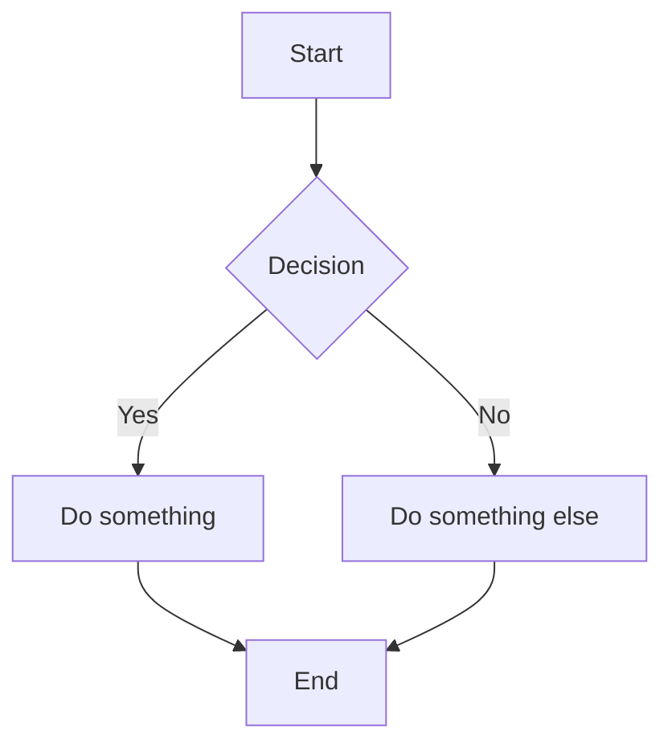
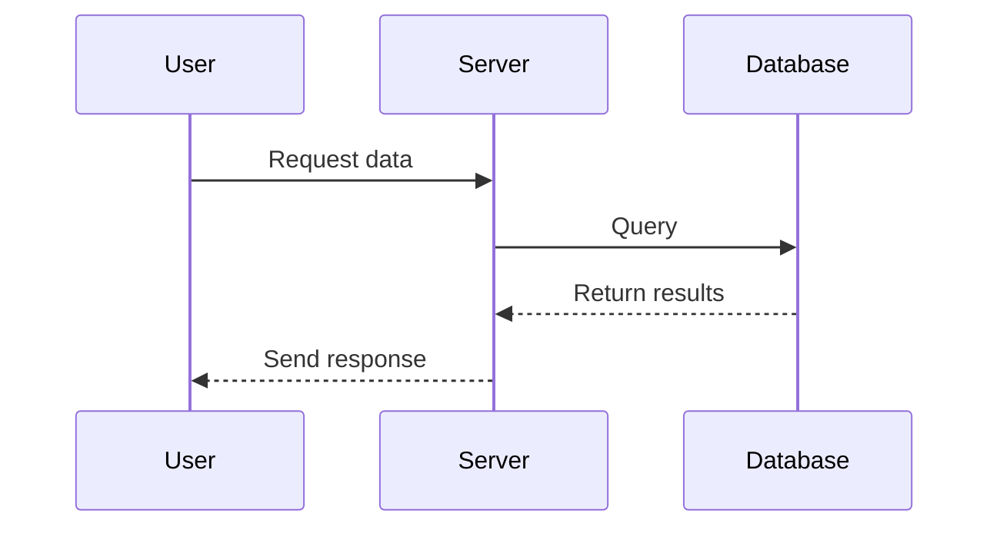
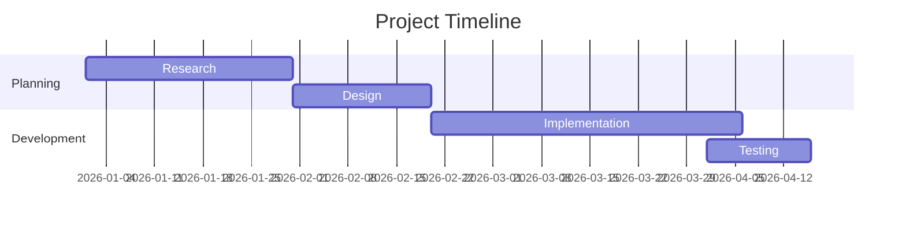
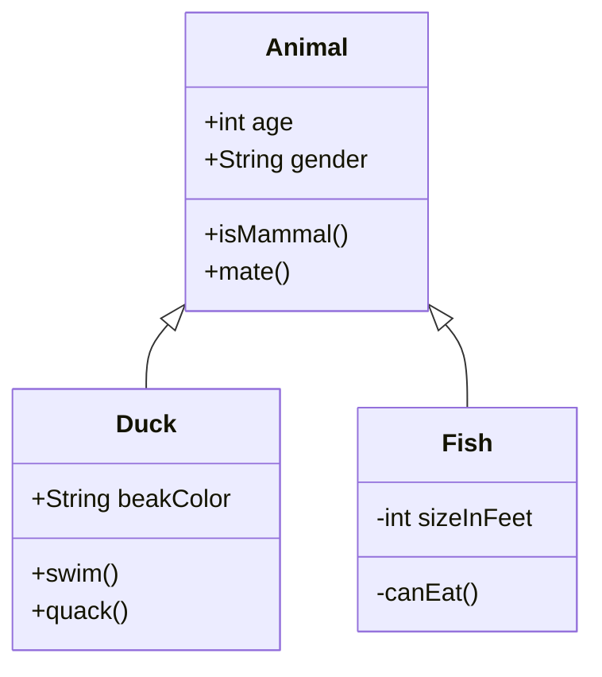

This guide covers the various shortcodes and rich content features available in the Hugo Stack theme. Shortcodes extend Markdown with powerful embedding and formatting capabilities.

<!--more-->

## Quote Shortcode

The `quote` shortcode displays formatted quotes with author attribution.


Imagination is more important than knowledge. Knowledge is limited. Imagination encircles the world.


### Usage

```

Your quote content here.

```

## YouTube Videos

Embed YouTube videos using Hugo's built-in shortcode.



### Usage

```

```

## Video Shortcode

Embed self-hosted or remote video files.

### Usage

```

```

You can also use multiple sources for browser compatibility:

```

```

## Mermaid Diagrams

Stack theme supports Mermaid diagrams out of the box. Simply use a code block with the `mermaid` language.

### Flowchart



### Sequence Diagram



### Gantt Chart



### Class Diagram



## GitLab Snippets

Embed code snippets from GitLab.

### Usage

```

```

## Gist Embedding

Embed GitHub Gists using Hugo's built-in shortcode.

### Usage

```

```

## Twitter/X Embedding

Embed tweets (note: may require additional configuration).

### Usage

```

```

## Figure Shortcode

Enhanced image display with captions and links.

```

```

### Usage

```

```

## Highlight Shortcode

Syntax highlighting with line numbers and highlighting specific lines.


package main

import "fmt"

func main() {
    fmt.Println("Hello, World!")
    fmt.Println("This line is highlighted")
}


### Usage

```

Your code here

```

Options include:
- `linenos=table` - line numbers in a table
- `linenostart=10` - start line numbers at 10
- `hl_lines=3 5-7` - highlight specific lines

## Instagram Embedding

Embed Instagram posts.

### Usage

```

```

## Vimeo Videos

Embed Vimeo videos.

### Usage

```

```

## Param Shortcode

Display site parameters in your content.

The site title is: 

## Ref and Relref

Create links to other pages in your site.

### Usage

```
[Link to another post]()
[Relative link]()
```

---

## Tips for Using Shortcodes

1. **Escape shortcodes** in documentation by using `/*` and `*/` inside the delimiters
2. **Combine shortcodes** with Markdown for richer content
3. **Check the theme docs** for additional shortcodes specific to Stack theme
4. **Test locally** before publishing to ensure embeds display correctly

For more information, see the [Hugo Shortcodes Documentation](https://gohugo.io/content-management/shortcodes/) and [Stack Theme Documentation](https://stack.jimmycai.com/).
