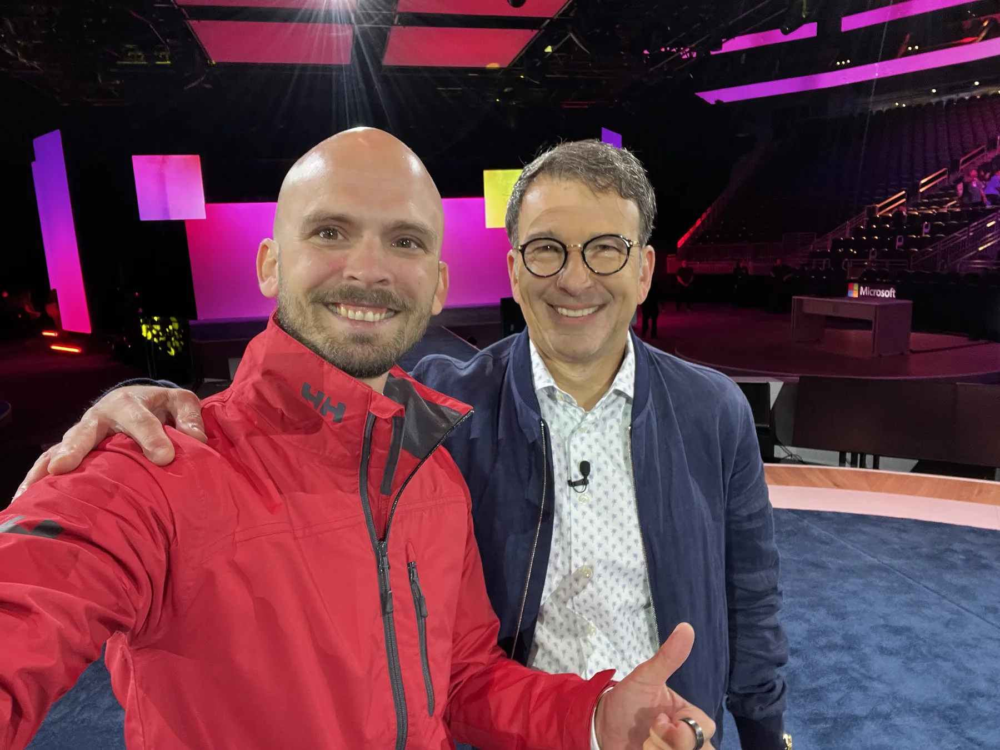

AI Architect in Microsoft's Office of the CTO, translating enterprise AI strategy into scalable architecture and measurable outcomes.

## About Me

Hi, I'm Ben - a Technical Architect working in the Office of the CTO at the Microsoft Innovation Hub for Germany and Austria. With over 15 years of international experience in enterprise architecture, End-User Computing, and cloud technologies, I help customers turn their vision into scalable architectures. Within the Innovation Hub, I operate at the intersection of technology strategy, AI transformation, and customer impact.

Born on premise - living in the cloud. I started my career racking servers and managing on-prem infrastructure. Today I partner with Microsoft's most strategic enterprise customers, engineering teams, and partners to shape end-to-end architectures. I think in systems - connecting technology, business, and people to deliver outcomes at scale.

## My 10x Advantage

Most tech bloggers are either deep engineers or strategy consultants. I am both - and I am sitting in Microsoft's CTO office with direct customer access. Every piece of content I create reinforces: I've been in the room, I've built the thing, and here's what actually works.

## About This Blog

From the server room to the boardroom.

B3N.B4UR_ is my space to think out loud. I write about the things I'm learning, the patterns I'm seeing, and the ideas I think are worth exploring.

- **Enterprise Architecture** - platform, cloud, and systems design patterns that scale.
- **AI Strategy** - operating models, decision frameworks, and value realization in enterprise AI.
- **Leadership at Scale** - cross-functional execution, influence, and team operating rhythms.
- **Career Growth** - practical lessons for architects and engineers building long-term impact.

## Impact at a Glance

A selection of the outcomes, communities, and architectures I have helped shape.

- Led large-scale End-User Computing projects spanning 75,000+ Cloud PCs and 100,000+ Virtual Machines.
- Built and led a cross-EMEA technical team of 36 Advanced Cloud Experts.
- Trained 1,200+ Cloud Solution Architects through technical bootcamps and readiness programs.
- Formed and led 15+ cross-EMEA initiatives, from go-to-market accelerators to strategic sales plays.
- Contributed to Azure Well-Architected Framework, Cloud Adoption Framework, and Architecture Center documentation.

## Career Journey

**Architect & Strategist - Microsoft (2021-Present).** I grew from an individual contributor to leading a 36-person technical organisation across EMEA, and then moved into the Office of the CTO. Today I shape end-to-end architecture and AI transformation strategies for Microsoft's most strategic customers.

**Deep Technical Specialist - Microsoft (2020-2021).** As an Advanced Cloud Expert and Azure Cloud Solution Architect, I led Well-Architected design sessions, proofs of concept, and large-scale deployments across EMEA.

**Before Microsoft (2009-2019).** A decade building the foundation across IT-Works, RaceChip, and HUGO BOSS - from cloud infrastructure and global WAN strategy to Citrix, Windows virtual desktops, and Active Directory redesign.

## Recognition

Microsoft Pinnacle Award FY25 - awarded to only 43 individuals out of 228,000+ Microsoft employees for outstanding leadership, community impact, and customer outcomes.

Microsoft Gold Award - recognising sustained excellence and significant business impact across Microsoft.

## What Drives Me

Most AI transformations fail not because the technology is not ready, but because they jump directly to a solution without understanding and defining the problem. They jump to models and demos without solving for data gravity, governance, or change management. I have made it my job to fix that gap.

I care about making complex technology accessible and useful - not just technically possible. The best way to grow is to empower others to exceed their own goals.

> I lead by example, inspire with passion, and treat every day as a chance to reset, learn, and unlock potential.

## Let's Connect

I'm always interested in conversations about enterprise-scale architecture, AI transformation leadership, or roles where technology strategy meets customer impact. Beyond tech, reach out if you want to geek out about cloud solutions, DJing, or surfing.
