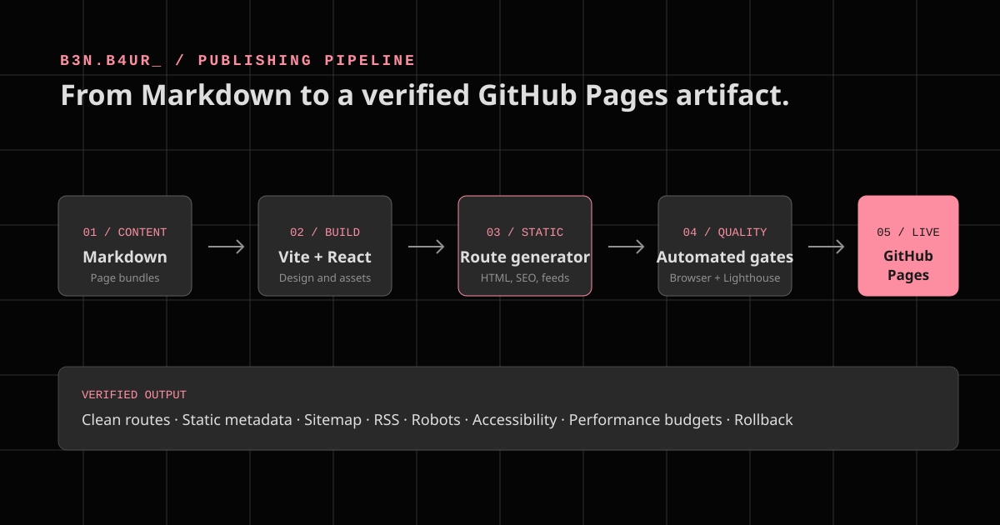

A personal blog can look finished long before it is ready to operate.

The visual design may be there. Articles may render. Links may work on one machine. But a production blog also needs predictable publishing, crawlable pages, accessible interaction, measurable performance, repeatable deployment, and a recovery path when something fails.

This is how I built those capabilities into B3N.B4UR_ without giving up the design and wording that made the site mine.

## The hosting boundary

The public site runs at:

```text
https://benmartinbaur.github.io/
```

GitHub Pages is the hosting boundary. It serves static files from a deployment artifact and does not provide an application server, database, or arbitrary server-side routing.

That constraint is useful. It keeps the operational model small:

- The repository is the source of truth.
- GitHub Actions builds and verifies the site.
- GitHub Pages serves the generated files.
- No backend is required.
- No tracking or analytics scripts are included.

## The architecture



The final pipeline has six stages:

1. Authors create Markdown page bundles.
2. Vite discovers and validates published content.
3. React provides the design and interactive experience.
4. A build script generates one static HTML document per canonical route.
5. Automated quality gates verify the output.
6. GitHub Actions deploys the verified `dist` artifact to GitHub Pages.

The important design choice is that React is not responsible for inventing public URLs at runtime. The build creates real files for the routes that people, browsers, crawlers, and social platforms visit.

## Clean routes with compatibility

The canonical routes are static:

```text
/
/posts/about-ben-martin-baur/
/privacy/
/impressum/
/recruiting/
/404.html
```

Older query-based URLs such as `?post=about-ben-martin-baur` and `?page=privacy` remain compatible in the React router. New navigation always uses the clean paths.

This gives the site two useful properties:

- A direct request for an article receives an article-specific HTML document.
- Existing links do not immediately break during the transition.

## Markdown as the publishing interface

Each article is a dated page bundle:

```text
src/content/posts/
  2026-08-18-building-an-industry-standard-github-pages-blog/
    index.md
    architecture-overview.svg
```

The folder date must match the front-matter date. The remainder of the folder name becomes the slug.

A post starts with YAML front matter:

```yaml
---
title: "Post title"
description: "A concise card and metadata description."
date: "2026-08-18"
category: "AI Architecture"
tags:
  - Architecture
  - GitHub Pages
reading_time: "7 min read"
image: "./optional-featured-image.webp"
draft: false
---
```

Required fields:

| Field | Purpose |
| --- | --- |
| `title` | Article heading, cards, search, and page metadata |
| `description` | Article introduction, cards, search, and metadata |
| `date` | Publication ordering and scheduled publishing |
| `category` | Home-page category filtering |

Optional fields include `tags`, `reading_time`, `image`, and `draft`.

Reading time is calculated when it is omitted. Drafts and future-dated posts are excluded. Duplicate slugs, malformed metadata, date mismatches, and missing local assets fail clearly instead of producing a partially broken article.

## Supported Markdown

The article renderer supports GitHub-flavored Markdown:

- Headings
- Links and local images
- Ordered and unordered lists
- Task lists
- Tables
- Blockquotes
- Inline code
- Fenced code blocks

For example:

```md
## Release checklist

- [x] Build canonical routes
- [x] Validate metadata
- [ ] Deploy to production

| Gate | Requirement |
| --- | --- |
| Accessibility | No serious axe violations |
| SEO | Route-specific static metadata |

> A build is not finished because it compiled. It is finished when its output is verified.
```

Raw HTML is intentionally not enabled in the React Markdown renderer. Article media lives beside the Markdown file and is resolved through the build.

## Static metadata and discovery

The Vite build initially produces the application shell and assets. A second build step reads the published front matter and generates route-specific documents.

Every canonical page includes:

- A route-specific title and description
- A canonical URL
- Open Graph metadata
- Twitter card metadata
- JSON-LD structured data

The same content manifest generates:

- `sitemap.xml`
- `index.xml` as the RSS feed
- `robots.txt`
- `404.html`

Using one content source matters. If article pages, search, RSS, and the sitemap each had separate registries, they would eventually disagree.

## Design and interaction

Static delivery did not require a new visual identity.

The production build preserves:

- The dark-first theme
- The `B3N.B4UR_` identity
- The single glowing triangle
- Search and category filtering
- Dark/light theme persistence
- The About article
- Privacy and Impressum pages
- The recruiter-focused executive profile
- Reduced-motion behavior

The design changes were architectural rather than cosmetic. Root-relative assets were required for clean nested routes, and all internal links moved from query strings to canonical paths.

## Quality gates

The project has one complete command:

```powershell
npm run quality
```

It runs:

1. Oxlint.
2. TypeScript and the production Vite build.
3. Static route and metadata generation.
4. Node integration tests for posts, sitemap, RSS, and robots.
5. Internal link and asset validation.
6. A production dependency audit.
7. Playwright browser tests.
8. axe accessibility checks.
9. Lighthouse budgets.

The browser suite covers canonical routes, legacy URLs, search, theme persistence, mobile overflow, and serious accessibility violations.

Lighthouse runs against Home, Article, Privacy, and Recruiting. The release budgets require:

| Metric | Budget |
| --- | ---: |
| Performance | 95 or higher |
| Accessibility | 100 |
| Best Practices | 100 |
| SEO | 100 |
| First Contentful Paint | 1.8 seconds or less |
| Largest Contentful Paint | 2.5 seconds or less |
| Total Blocking Time | 200 milliseconds or less |
| Cumulative Layout Shift | 0.10 or less |

The accessibility gate found a real defect before release: inactive recruiter timeline entries used opacity to create visual hierarchy, which reduced their effective text contrast. The fix preserved the motion treatment without dimming readable content.

That is exactly what a useful quality gate should do. It should find product defects, not merely produce a green badge.

## Continuous deployment

The GitHub Pages workflow:

1. Checks out the repository.
2. Installs Node.js and npm dependencies.
3. Installs the Playwright Chromium browser.
4. Configures GitHub Pages.
5. Runs the complete quality command.
6. Uploads `dist` as the Pages artifact.
7. Deploys only after the build job succeeds.

A separate pull-request workflow runs the same quality command and reviews dependency changes before they reach `main`.

Local and CI behavior use the same scripts. That reduces the gap between "works on my machine" and "works in production."

## Privacy and security decisions

The site uses no analytics or tracking cookies.

Security is deliberately simple:

- GitHub Pages serves static output.
- Markdown raw HTML is disabled.
- Content metadata and local assets are validated.
- Production dependencies are audited.
- Workflow permissions are limited to the access required for Pages.
- Deployment only receives a verified artifact.

GitHub Pages still processes connection data such as visitor IP addresses for security purposes. "No analytics" does not mean "no infrastructure logs."

## What I learned

The biggest lesson was not about React, Hugo, or Markdown.

It was that a blog has two products:

1. The experience a reader sees.
2. The system an author and operator depend on.

The first needs clarity, personality, and strong design. The second needs explicit contracts, deterministic builds, observable failures, and a rollback path.

GitHub Pages is a good fit when those contracts are resolved at build time. React is a good fit when interaction and design fidelity matter. Markdown is a good fit when publishing should feel like writing rather than editing application code.

The architecture works because each tool has a narrow job - and because the final output is tested as a website, not just as source code.
